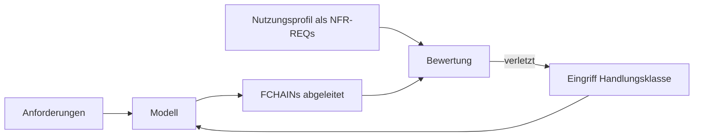

# Konzept: Modell- vs. Realisierungsarchitektur

25. Sept. 2026 · @Andreas Sigloch · Fassung 2 (mit Korrekturen und Spike-Befund, siehe letzter Abschnitt)

## Ziel und Kernthese

Dasselbe Modell kann eine Banking-App mit harten Sicherheitsanforderungen und eine
High-Throughput-Social-Media-App tragen. Der Unterschied liegt nicht im Modell, sondern in der
Realisierung, und alle dafür relevanten Parameter stehen in der Wirkkette.

Das Dokument trennt zwei bisher vermischte Architekturbegriffe, definiert Kennzahlen für die
Realisierungsbewertung auf den FCHAINs und legt ein Gegengewicht fest, das die Optimierung vor
Modelldegradation schützt. Es ersetzt den Realisierungsteil der heutigen R⁶-Bewertung; deren
Modellteil bleibt als Nebenbedingung (Abschnitt „Verhältnis zu R⁶").

## Begriffsklärung

Architektur bezeichnet in GraphCode zwei verschiedene Dinge, die getrennt bewertet werden müssen.

| Aspekt | Modellarchitektur | Realisierungsarchitektur |
|---|---|---|
| Zweck | Verständlichkeit und Änderbarkeit der Codebase | Umsetzung der Wirkkette im Kontext |
| Gegenstand | Elemente, Ebenen, Schnitte | FCHAINs als gerichtete Pfade durch das Modell |
| Leitfragen | 7 ± 2 Elemente pro Ebene? Hohe innere Bindung? Saubere Schnittstellen (Blackbox)? | Parallelisierbar? Kette zu lang? Zu viele Abzweigungen oder Engstellen? |
| Charakter | Domänenneutral | Kontextabhängig (Nutzungsprofil) |
| Verankerung | Grammatik, Pattern-Matrix, Kardinalitäten, Modellgüte-Regeln | NFR-REQs, die eine FCHAIN (oder das SYS) erfüllen muss |

Die Anforderungen bestimmen, welche Funktionen existieren. Das Systemprofil, verankert als
NFR-REQs, bestimmt und optimiert den Schnitt, also die funktionale Architektur mit ihren
Wirkketten. Das ist ein iterativer Prozess: Schnitt ableiten, gegen das Profil bewerten, anpassen,
neu messen; die Kriterien der Modellarchitektur (7 ± 2, Bindung, Schnittstellen) wirken dabei als
Nebenbedingung. Ein Audit-Log entsteht deshalb aus einer Anforderung, nicht aus dem Profil.

## Paradigmenwechsel: Profil optimiert den Schnitt, nicht den Funktionsumfang

Das bisherige Anwendungsprofil (Banking, Multimedia usw.) sollte zu Beginn der Modellerstellung das
Modell festlegen. Das ist falsch. Das Profil entscheidet nicht, welche Funktionen es gibt, sondern
wirkt als Schwellenwertsatz auf die FCHAINs und optimiert iterativ deren Schnitt.

- Die FCHAINs hängen an den Use Cases (`UC -compose-> FCHAIN`) und kommen aus dem Modell heraus.
- Das Profil schlägt sich als NFR-REQ nieder, das die FCHAIN erfüllen muss
  (`FCHAIN -satisfy-> REQ`, heute schon legal; z. B. „synchrone Tiefe ≤ 2").
- Die **Laufzeit**-Bewertung erfolgt nur auf der Wirkkette, nicht auf Modul- oder Funktionsgruppen.
  Nur die Kette erzeugt Laufzeitverhalten; globale Topologiemaße wären ein Proxy.
- Änderbarkeit ist keine Laufzeiteigenschaft. Sie bleibt auf der Modellseite (Kohäsion, Kopplung,
  Blast-Radius) und wirkt als Nebenbedingung, nicht als Zielgröße.

Ein Eingriff verändert die Kette und damit das Modell, funktional bleibt es dieselbe Wirkkette von
Start bis Wirkung. Genau diese Optimierung des Modells über die Kette ist gewollt.

## Voraussetzung: die Kette muss eine Kette sein

Die Kennzahlen setzen voraus, dass eine FCHAIN ein **gerichteter, zusammenhängender Pfad vom
Auslöser zur Wirkung** ist. Die Grammatik verlangt das heute nicht: `FCHAIN -compose-> FUNC` ist eine
Menge, die Reihenfolge ergibt sich erst aus `FUNC -io-> FLOW -io-> FUNC`. Die bestehenden Regeln
prüfen nur Teile davon:

| Defekt | heute erkannt durch | Schwere |
|---|---|---|
| Glied ohne io-Eingang oder -Ausgang | R-31 | warning |
| Kette ohne ACTOR-Auslöser bzw. -Empfänger | FC-04 | warning |
| Glied ohne FLOW-Verbindung zum Rest der Kette | IO-01 | warning |
| Übergabe zwischen FUNCs ohne gemeinsame Kette | R-21 | warning |
| **Kette zerfällt in Teile, die nur über einen Knoten außerhalb der Kette verbunden sind** | — | — |

Die Lücke in der letzten Zeile entsteht, weil IO-01 zwei Glieder schon dann als verbunden zählt,
wenn beide denselben FLOW konsumieren. Eine Wirkkette verlangt dagegen eine gerichtete Kante
Erzeuger → Verbraucher innerhalb der Kette. Zwei Fälle:

- **Fehlendes Glied:** der verbindende Schritt liegt außerhalb der Kette. Typisch ist der Speicher:
  `mutate → graph-store → evaluate-rules`. Fehlt der Speicher als Glied, ist ausgerechnet die
  offensichtlichste Engstelle (Single-Writer-Store) für die Kettenbewertung unsichtbar.
  Zustandsübergänge über einen Speicher gehören deshalb in die Kette.
- **Sack:** parallele, voneinander unabhängige Dienste an einer gemeinsamen Quelle, als eine FCHAIN
  modelliert. Das ist keine Wirkkette, sondern mehrere; sie werden aufgeteilt.

Neue Regel (Kandidat **FC-05**, warning, Familie-Review): die Glieder einer FCHAIN bilden über
Erzeuger-→-Verbraucher-Kanten genau eine Komponente mit mindestens einem Eingang und einem Ausgang.
Solange eine Kette FC-05 verletzt, ist sie **nicht bewertbar**, und die Bewertung sagt das, statt
eine Zahl zu liefern.

Alle Verdrahtungsregeln sind heute Warnungen; das Gate blockt nur Errors. Deshalb sammeln sich die
Defekte an, obwohl sie gemeldet werden. Ein Profilurteil über ein Modell braucht als Vorbedingung
eine **Bewertbarkeitsquote** (bewertbare Ketten / alle Ketten), die neben jedem Urteil steht, analog
zur Bindungsquote bei RC-*.

## Kennzahlen der Wirkkette

Acht Kennzahlen vermessen eine FCHAIN: fünf pro Kette, drei aus der Vernetzung mehrerer Ketten. Die
Werte sind objektive Realisierungseigenschaften; erst das Profil macht daraus ein Urteil.

| Gruppe | Kennzahl | Bedeutung | heute berechenbar |
|---|---|---|---|
| Kette | Gesamtlänge | Schritte zwischen Auslöser und Wirkung (längster Pfad, Schleifen zu einem Schritt zusammengefasst) | ja |
| Kette | Synchrone Tiefe | Schritte, die zwingend nacheinander laufen (kritische Kette) | nein — braucht sync/async am FLOW; bis dahin = Gesamtlänge als obere Schranke |
| Kette | Verzweigungsgrad | Anzahl paralleler Äste (Fan-out) | ja |
| Kette | Modulgrenzen | Anzahl gekreuzter MOD-Grenzen (Modul über compose-Vorfahren geerbt) | ja |
| Kette | Rückkopplungen | Schleifen innerhalb der Kette (nicht-triviale starke Komponenten) | ja |
| Vernetzung | Geteilte Knoten | Elemente, durch die mehrere Ketten laufen | ja |
| Vernetzung | Engstellen-Grad | Geteilter Knoten, der synchron durchlaufen wird | nur obere Schranke (geteilter Durchgangsknoten) |
| Vernetzung | Fehlerpfad-Tiefe | Wie weit ein Fehler zurückwirken muss | nein — braucht Markierung von Fehler-/Kompensationsflüssen |

Jeder Schritt zählt zunächst gleich. Die Gewichtung über Skalierungsklassen folgt weiter unten.

Die drei Vernetzungskennzahlen sind Eigenschaften über alle Ketten hinweg, nicht einer einzelnen.
Ihre Schwellen stehen deshalb in einem NFR-REQ, das das SYS erfüllt, nicht an einer FCHAIN.

## Drei Beispielprofile

Ein Profil ist ein Satz von Schwellenwerten auf die Kennzahlen plus ein Leitsatz. Die Werte sind
Richtgrößen und müssen pro Projekt kalibriert werden.

| Kennzahl | Banking | Social Media | Embedded / Echtzeit |
|---|---|---|---|
| Synchrone Tiefe | ≤ 8 | ≤ 2 im Nutzerpfad | hart begrenzt |
| Gesamtlänge | großzügig | frei (asynchron) | hart begrenzt |
| Verzweigungsgrad | moderat | hoch erwünscht | minimal |
| Rückkopplungen | erlaubt | vermeiden | verboten |
| Geteilte Knoten (SYS) | erwünscht (Konsistenz) | synchron = Verstoß | vermeiden |
| Fehlerpfad | bis zum Anfang | kurz, Ereignisverlust tolerierbar | deterministisch |
| Max. Skalierungsklasse im Nutzerpfad | linear bis n log n | linear | konstant / beschränkt |
| Leitsatz | Korrektheit vor Geschwindigkeit | Durchsatz vor Konsistenz | Vorhersagbarkeit vor allem |

**Beispiel „Zahlung auslösen".** Die FCHAIN läuft: Eingabe validieren → Deckung prüfen →
Betrugsprüfung → Buchung schreiben → Audit-Eintrag → Bestätigung senden. Sechs Schritte, fünf
synchron, zwei Modulgrenzen, ein geteilter Knoten (Buchung).

- Banking: bestanden.
- Social Media: verletzt (synchrone Tiefe 5 > 2). Antwort: Audit-Eintrag und Bestätigung entkoppeln,
  nicht das Modell neu schneiden.

Gleiche Kette, gleiches Modell, zwei Urteile. Das Beispiel ist zugleich die Positivkontrolle des
Spikes: die Berechnung liefert Länge 6, Fan-out 1, 2 Grenzen, 0 Schleifen, 1 geteilten Knoten.
Die Unterscheidung Banking/Social Media hängt aber vollständig an der synchronen Tiefe — ohne
sync/async-Markierung fallen beide Urteile zusammen.

## Handlungsklassen

Eine Profilverletzung führt über drei Schritte zum Eingriff: Diagnose (welche Kennzahl, welcher
Knoten treibt sie), Wahl der Handlungsklasse, Nachmessung nach Neuableitung der Kette.

| Handlungsklasse | Wirkung auf die Kette | Auslöser | Preis auf der Modellseite | heutiger Operator |
|---|---|---|---|---|
| Entkoppeln | Synchrone Tiefe sinkt, Länge bleibt | Zu hohe synchrone Tiefe | Konsistenz | Attribut am FLOW (Realisierung, kein Schnitt) |
| Zusammenlegen | Länge und Tiefe sinken | Künstlich getrennte Schritte | Trennschärfe, Kohäsion, Blast-Radius | `OP-MERGE` in `graph_suggest` (vorzeichenbehaftet) |
| Verschieben | Modulgrenzen sinken | Zu viele Grenzübertritte | Modulzuschnitt | allocate-Kante verschieben, `workOrder` nennt die Dateien |
| Aufteilen | Engstelle entschärft | Überlasteter geteilter Knoten | Elementanzahl | — |
| Vorverlagern | Wiederholter teurer Schritt fällt weg | Gleicher Schritt in vielen Ketten | Zusätzliche Abhängigkeit | — |

Reihenfolge bei einer Verletzung: Erst prüfen, ob eine andere Realisierung das Profil erfüllt
(Entkoppeln ist eine Attributänderung, kein Schnitt). Erst wenn keine genügt, wird das Modell neu
geschnitten.

## Gegengewicht Blast-Radius und Degradationsschutz

Wirkketten-Optimierung allein degradiert das Modell („die beste Funktion ist die, die nicht da
ist"). Der Blast-Radius ist die externe Gegengröße: Er läuft der Kettenoptimierung entgegen und
lässt sich nicht durch Umdefinieren schönrechnen.

**Blast-Radius.** Transitive Hülle der Änderung eines Elements, in zwei Richtungen:

- Vorwärts: FCHAINs, die durch das Element laufen und neu bewertet werden müssen
  (heute weitgehend durch `graph_impact` abgedeckt).
- Rückwärts: REQs, die das Element über satisfy erfüllt und die neu verifiziert werden müssen. Das
  ist die teurere Richtung, weil sie Nachweisarbeit auslöst (heute nur einzeln über `graph_context`).

**Gegenläufigkeit.** Zusammenlegen kürzt Ketten, vergrößert aber den Blast-Radius. Feines Zerlegen
verkleinert den Blast-Radius, verlängert aber die Ketten.

**Abwägung: lexikographisch, keine gewichtete Front.** Ein Eingriff wird in fester Rangfolge
beurteilt: (1) Invarianten gehalten, (2) Profilverletzungen der Ketten, (3) Modellgüte innerhalb
ihrer Schwellen, (4) volatilitätsgewichteter Blast-Radius. Eine Gewichtung zwischen den Stufen gibt
es nicht; sie wäre wieder ein implizites Ideal, wie es die R⁶-Gewichte heute sind.

**Gewichtung.** Der rohe Blast-Radius behandelt alle Elemente gleich. Er wird mit der Volatilität
gewichtet: großer Radius an einem stabilen Element ist harmlos, an einem volatilen teuer.

### Schutzmechanismen

1. Invariante: Jede Anforderung behält eine Realisierung. Wegoptimierte Funktionen fallen über das
   Satisfy/Verify-Netz auf, nicht über eine Metrik (heute durchgesetzt).
2. Modellgüte ist Nebenbedingung, nicht Zielgröße: optimiert wird die Kette unter der Bedingung,
   dass Kohäsion und Kopplung ihre Schwellen halten.
3. Vorab festgelegte Prognose: was besser werden soll und was gleich bleiben muss. Eine
   Verbesserung, die das Gleichbleiben verletzt, zählt nicht.
4. Anti-Drift über realRef: Kein Code ohne Modellentsprechung (heute durchgesetzt über R-20 und RC-*).

## Skalierungsklasse und Volatilität

Zwei Klassen pro Element ersetzen die unbekannte absolute Laufzeit und die unbekannte
Änderungshäufigkeit. Beide sind zur Modellzeit bekannt und beide werden per Maximum aggregiert,
nicht gemittelt.

**Skalierungsklasse** (aus der geplanten Berechnung oder Datenbankabfrage): konstant,
logarithmisch, linear, n log n, quadratisch, exponentiell.

- Die dominierende Klasse bestimmt die Kette: ein quadratischer Schritt dominiert, egal wie schlank
  der Rest ist.
- Verschachtelung multipliziert: ein Schritt, der innerhalb einer Iteration einen anderen aufruft,
  ergibt das Produkt der Klassen. Die Iteration wird **am FLOW** geführt: Traces tragen im SSOT keine
  Attribute, der FLOW ist die Kante als eigenes Element.
- Die Klasse ist ein Realisierungsattribut, keine Modelleigenschaft. Später ersetzen
  Betriebsmesswerte die Schätzung.

**Volatilitätsklasse** (Änderungswahrscheinlichkeit, abgeleitet aus der Quelle der Anforderung):

| Quelle der Anforderung | Volatilität |
|---|---|
| Fremdsystem, Schnittstelle, Marktpreis | hoch |
| Gesetz, Regulierung, Steuersatz | mittel, mit bekannten Zyklen |
| Fachlogik aus der Sache selbst | niedrig |

- Die Volatilität sitzt an der Anforderung; ein Element erbt das Maximum aller REQs, die es per
  satisfy erfüllt.
- Entwurfsregel: volatile Elemente an den Rand, nicht in die Mitte eines großen Blast-Radius.
- Prüfbarkeit: Audit-Trail und Trajectory halten die Änderungshistorie je REQ heute schon fest. Eine
  als stabil eingestufte, aber mehrfach geänderte Anforderung ist damit sofort als Fehleinstufung
  erkennbar — ohne auf Betriebsdaten zu warten.
- Retrospektiv ergänzt die Änderungsrate der Kettenwerte über Versionen die Einstufung: eine
  wachsende Kette signalisiert, dass Anforderungen nicht mehr zum Schnitt passen.

## Checkliste pro Anforderung

Drei Fragen bei der Erhebung jeder Anforderung genügen. Sie sind kein Zusatzaufwand, sondern werden
ohnehin geklärt, nur jetzt auswertbar festgehalten.

1. Quelle: Woher kommt die Anforderung (Fachlogik, Regulierung, Fremdsystem/Markt)? →
   Volatilitätsklasse
2. Skalierung: Wie skaliert das, was sie verlangt (Iteration über eine Menge, Paarbildung, externer
   Aufruf)? → Skalierungsklasse
3. Zeitvorgabe: Wie hart ist die zeitliche Anforderung (Nutzerpfad synchron, nachgelagert,
   Echtzeit)? → Einordnung gegen das Profil und sync/async der beteiligten FLOWs

Auf dieser Einstufung werden die Funktionen ausgelegt: Volatilität bestimmt die Lage im Modell,
Skalierung und Zeitvorgabe die Bewertung der FCHAIN.

## Verhältnis zu R⁶

R⁶ misst heute sechs globale Topologiemaße auf dem Architektur-Teilgraphen und steuert
`graph_suggest` über Gewichte aus `.graphcode/target-profile.json`. Die Formeln tragen ein
implizites Architekturideal (verteiltes System): `scalability = 1 − maxBetweenness` bestraft Hubs,
`viability` belohnt eine große Komponente. Für ein Kernel-System sind zwei Dimensionen im
Vorzeichen falsch, nicht in der Gewichtung.

| R⁶-Dimension | Charakter | künftig |
|---|---|---|
| modifiability (Newman-Q) | Modellgüte | bleibt, als Nebenbedingung mit Schwelle |
| coherence (interner Kantenanteil) | Modellgüte | bleibt, als Nebenbedingung mit Schwelle |
| flowEfficiency (mittlere Pfadlänge) | Realisierungs-Proxy | ersetzt durch Gesamtlänge / synchrone Tiefe je Kette |
| scalability (1 − maxBetweenness) | Realisierungs-Proxy | ersetzt durch Engstellen-Grad + Skalierungsklasse |
| faultTolerance (Redundanzdichte) | Realisierungs-Proxy | ersetzt durch Fehlerpfad-Tiefe |
| viability (größte Komponente) | Archetyp-Annahme | entfällt |

Das Zielprofil wandert damit aus der Config (`target-profile.json`, bewusst keine Graph-SSOT) in den
Graphen: als NFR-REQs, geprüft durch das Gate und rückverfolgbar. Es bleibt kein zweiter Weg zum
Architekturteil stehen.

## Umsetzung in GraphCode

Die Umsetzung braucht keine neuen Modellelementtypen. Sie ergänzt Attribute, eine Regel und eine
Bewertungsstufe — das ist trotzdem eine contracts-Änderung mit Familie-Review und Versionssprung
(neue Regel FC-05, neue Pflichtattribute, reduzierte R⁶ in se-engine).

- [ ] FC-05 „Kette ist gerichtet zusammenhängend" + Bewertbarkeitsquote je Modell → CR-SM-363
- [ ] FLOW-Attribute `sync` (sync/async) und `iterates`; Markierung von Fehler-/Kompensationsflüssen → CR-SM-364 (Review-Runde ausstehend)
- [ ] REQ-Attribut `source` (Fachlogik / Regulierung / Fremdsystem) und Ableitungsregel für Volatilität
- [ ] Element-Attribut Skalierungsklasse
- [ ] Deterministische Berechnung der acht Kettenkennzahlen und der dominierenden Skalierungsklasse
      pro FCHAIN (Spike-Referenz: `scripts/spike-kettenkennzahlen.mjs`)
- [ ] Blast-Radius rückwärts (satisfy/verify) ergänzen, volatilitätsgewichtet
- [ ] Profil als NFR-REQs (FCHAIN bzw. SYS erfüllt REQ); `target-profile.json` und Skill
      `se:target-profile` umstellen
- [ ] Bewertung Kette gegen Profil mit Diagnose (Kennzahl + treibender Knoten) und zulässigen
      Handlungsklassen; `graph_suggest` auf die lexikographische Rangfolge umstellen
- [ ] Fit-Advisory je Mutation: nur die Ketten durch die berührten FUNCs nachmessen
- [ ] R⁶ auf die zwei Modellgüte-Dimensionen reduzieren; Realisierungsdimensionen löschen
- [ ] Vorher/Nachher-Prognose in das Closed-Loop-Framework einhängen

### Offene Fragen

- Wie werden die Profilschwellen kalibriert, bevor Betriebsdaten vorliegen? (Vorschlag: Verteilung
  der Kettenkennzahlen über den Familie-Korpus als Ausgangspunkt, sobald die Bewertbarkeitsquote
  ≥ 0,8 ist.)
- Wie wird ein asynchroner Übergang am FLOW markiert, wenn ein FLOW mehrere Verbraucher mit
  unterschiedlicher Kopplung hat? (Ein Attribut je FLOW reicht dann nicht; ggf. FLOW aufteilen.)
- Tragen die Kettenkennzahlen Information jenseits von R⁶? Im Spike nicht entscheidbar (siehe unten).

## Spike-Befund (25.09.2026)

`scripts/spike-kettenkennzahlen.mjs`, nur lesend, auf den exportierten SSOTs von 12 Familie-Graphen
(10 mit FCHAINs, 76 Ketten).

- **Berechenbar:** Positivkontrolle („Zahlung auslösen") und Gegenprobe (Schleife + Ast) liefern die
  erwarteten Werte. Fünf der acht Kennzahlen sind heute deterministisch berechenbar.
- **Bewertbarkeit:** nur **32 von 76 Ketten** sind bewertbar (eine Komponente mit Ein- und
  Ausgang). Zwei von zehn Graphen erreichen die Schwelle 0,8 (graphcodedemo, bok); graphcode selbst
  liegt bei 6 von 22.
- **Ursachen** (Mehrfachnennung): 15 Ketten mit losen Gliedern (R-31-Klasse), 13 mit fehlendem Glied
  (meist der Speicher), 9 Säcke paralleler Dienste, 15 ohne Eingang, 16 ohne Ausgang (FC-04-Klasse).
  Die 20 Ketten mit fehlendem Glied oder Sack meldet heute keine Regel.
- **Realisierungsattribute:** im gesamten Korpus existiert kein Attribut für sync/async,
  Skalierung, Volatilität oder Quelle. Synchrone Tiefe, Engstellen-Grad und Fehlerpfad-Tiefe sind
  deshalb heute nicht berechenbar.
- **Mehrwert gegenüber R⁶:** r(mittlere Kettenlänge, flowEfficiency) = −0,45 über n = 7 Graphen —
  zu wenige Punkte für ein Urteil; zwei Graphen haben flowEfficiency 0,00. Offen.

## Änderungen gegenüber Fassung 1

- Laufzeitbewertung nur auf der Kette, Änderbarkeit bleibt Modellseite (vorher: „nur auf der Kette"
  ohne Einschränkung).
- Neuer Abschnitt „Voraussetzung: die Kette muss eine Kette sein" mit Regelkandidat FC-05,
  Speicher als Kettenglied und Bewertbarkeitsquote.
- Kennzahlentabelle um „heute berechenbar" ergänzt; Vernetzungsschwellen ans SYS.
- Handlungsklassen auf die vorhandenen Operatoren abgebildet.
- Offene Frage „Scheitelpunkt" entschieden: lexikographische Rangfolge.
- Iteration am FLOW statt als Kanteneigenschaft (Traces tragen keine Attribute).
- Volatilitätsprüfung über Audit-Trail sofort möglich.
- Neuer Abschnitt „Verhältnis zu R⁶"; Umsetzung als contracts-Änderung benannt.
- Spike-Befund ergänzt.
