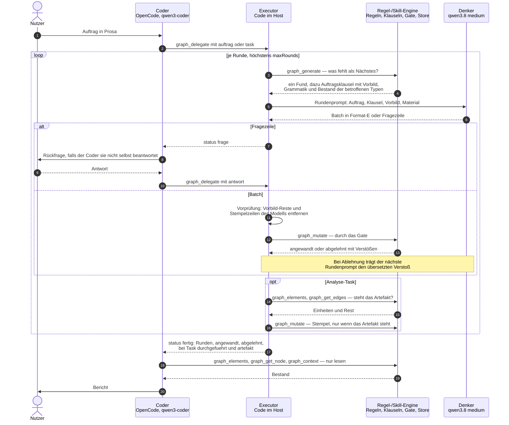

# Kommunikation im lokalen Arm (Zielkette D2)

Stand: graphcode `da289e2` (CR-GC-721..725), Aufbau von `agentdiary-local-3`.

| Rolle | Was es ist | Spricht mit |
|---|---|---|
| **Coder** | OpenCode mit qwen3-coder — der Client | Nutzer, Executor (nur über `graph_delegate` und drei Leser) |
| **Executor** | Code im graphcode-Host, kein Modell — die Rundenschleife | Coder, Regel-/Skill-Engine, Denker |
| **Denker** | qwen3.8 mit `reasoningEffort: medium`, über das sigllm-Gateway | nur Executor |
| **Regel-/Skill-Engine** | Code im selben Host: Regelkatalog, Auftragsklauseln mit Vorbild, Gate, Store | nur Executor |

Coder und Denker sprechen nie miteinander. Der Denker sieht weder Werkzeuge noch den Nutzer; er bekommt
je Runde einen Text und gibt einen Text zurück.

## Was das Diagramm zeigt

- **Ein Schreibweg.** Nur der Executor ruft `graph_mutate`. Der Coder hat das Werkzeug nicht, der Denker
  hat gar keine Werkzeuge.
- **Skills als Text, nicht als Werkzeug.** Der Client-Weg (Frontier) lädt einen Skill und arbeitet ihn ab.
  Hier liefert die Engine je Runde eine Klausel mit einem Format-E-Vorbild; der Executor legt sie dem
  Denker in den Prompt.
- **Der Stempel ist Code.** Den Abschluss einer Analyse schreibt der Executor, wenn das Artefakt im
  Graphen steht. Eine Stempelzeile des Denkers wird vor dem Gate verworfen.
- **Rückfragen laufen über den Coder.** Der Denker stellt sie als Fragezeile; der Executor meldet
  `status: frage`; der Coder beantwortet sie aus Material oder fragt den Nutzer.
- **Warten.** Läuft eine Delegation länger als das Warte-Budget, kommt `status: laeuft`; der Coder
  ruft `graph_delegate({})` erneut auf (im Diagramm weggelassen).
