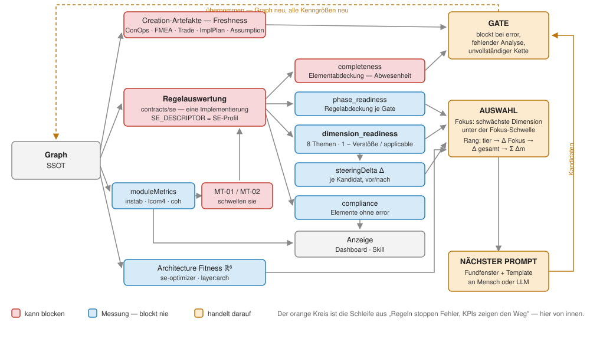
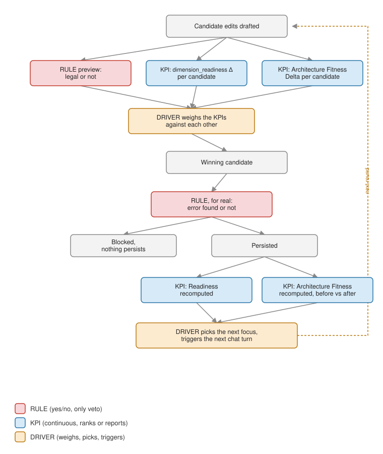
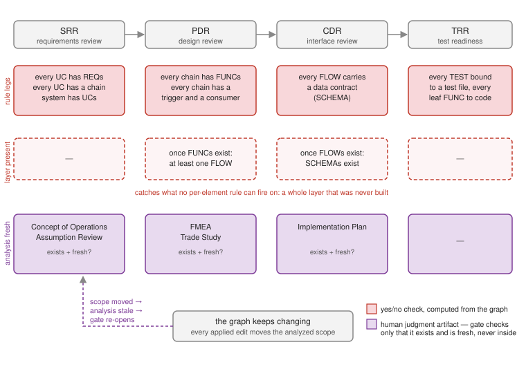
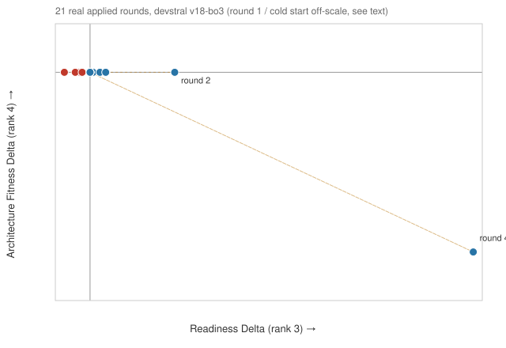
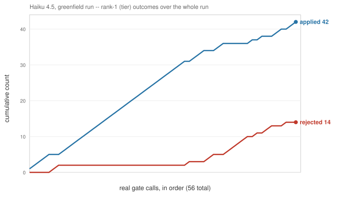

# The Scoring Landscape — Every Measurement, and How They Relate

*The nerd companion. [The story](04-the-graphcode-story.md) and [the claims](06-claims.md) compress
several distinct measurement systems into one simple narrative, on purpose — that's the right level
for a first read. This article is for when "wait, are these the same number?" comes up. It assumes
[Under the Hood](03-graphcode-harness-goal-and-concept.md) and
[the advisory roundtrip](05-the-advisory-roundtrip.md).*

*Normative one-pager — every measurement, its single computation site, its denominator and where it is
consumed: [`docs/MESSGROESSEN.md`](../MESSGROESSEN.md). When this article and that page disagree, the
page wins; this one explains, it does not define.*

## The whole landscape on one picture

Every measurement, what produces it, and which of the three actors acts on it — the gate that blocks,
the driver that picks the next edit, or the display a human reads. Nothing is measured that nobody
acts on.

## The shape: rules gate, KPIs steer — before the edit and after it

Two kinds of number appear everywhere in graphcode, and they behave completely differently:

- **Rules are yes/no.** A rule either fires or it doesn't — legal or not, complete or not. No KPI
  ever blocks anything; a review gate additionally holds on two non-KPI conditions of the same
  yes/no kind (a required analysis artifact missing or stale, and an incomplete derivation chain —
  both in "three kinds of leg" below).
- **KPIs are continuous.** A number that goes up or down — never a veto by itself, always an input to
  ranking or reporting.

And everything happens on one of two sides of a single edit: **before** it (while candidates are
still being weighed) or **after** it (once it's real). This is the same shape whether "the driver"
is graphcode's own built-in executor for a small model, or a frontier model reasoning about its own
draft edits inside a chat — the loop underneath is identical either way.

Red = rule, blue = KPI, orange = the driver doing the weighing. Notice the rule box appears *twice*
— once as a non-binding preview (before, just to drop illegal candidates) and once for real (the
actual gate) — but it's the same yes/no question both times. The KPI boxes never repeat that
pattern: they're always continuous, always feeding a ranking or a report, never a veto.

**When the real gate blocks the winning candidate**, the rejection doesn't go to some separate
judge — it goes back into the same conversation, as the next thing the model sees. Running the
built-in executor, the driver reformats the raw verdict into a compact "here's what's wrong, resubmit
the full corrected batch" message and appends it to that candidate's own message history. Running
inside an interactive assistant instead (no separate driver in the loop), the raw verdict comes back
as an ordinary tool result, and the assistant's own reasoning decides what to do with it — same
information, no translation step in between.

**The candidate set itself can change mid-round, not just the picture between rounds.** If *every*
candidate in a batch comes back blocked, one of them — the least-bad — gets sent back to the model
with that rejection message, revised, and re-probed before ranking happens again. That's a
demand-triggered repair, not a standing feature: it only fires on total failure, unlike everything
else in this diagram, which runs the same way every time regardless of how the model is doing. (An
interactive assistant working on its own, without the driver, can be told to revise *any* rejected
candidate at its own discretion — a looser version of the same idea, driven by the model's judgment
instead of a fixed trigger.)

## The two KPIs, and what "weighed against each other" means

The two blue boxes in the diagram are computed completely separately and read differently:

- **`dimension_readiness` Δ** — would this candidate move one of the 8 project-area scores (see below)
  closer to done? Computed from the same rule violations as everything else, just projected onto a
  "how much better" number instead of a yes/no.
- **Architecture Fitness Delta** — would this candidate move the six whole-graph structure numbers
  (see further below) in a useful direction?

"Weighed against each other" means: among the candidates that passed the rule preview, prefer the one
with the better `dimension_readiness` Δ first, and use Architecture Fitness Delta only to break a tie. They
are not added into one number — one is the primary ranking, the other a tiebreaker.

**The tiebreaker is a sum, not a veto.** Architecture Fitness has six numbers, and a candidate can
move some of them up and others down at the same time. Breaking a tie with it means adding all six
changes together and preferring the higher total — a candidate that makes one number worse can still
win, if it makes the others enough better. Nothing gets thrown out just for having a downside
somewhere; a downside only shows up as a smaller (or negative) total. The only stage that actually
discards a candidate is the rule check, at the very top.

## Three views over the same rule violations

Beyond feeding the KPIs above, the identical set of rule violations also gets grouped three more
ways, for three different questions — none of these blocks anything either, they're read-outs:

| View | Groups rules by | Answers |
|---|---|---|
| **`dimension_readiness`** (8 scores) | SE topic (requirements, use cases, functional architecture, module allocation, verification, interfaces, change requests, milestones) | "Which *area* of the project needs work next?" |
| **`phase_readiness`** (System Requirements Review, Preliminary Design Review, Critical Design Review, Test Readiness Review) | project stage — *rule coverage*: which of the stage's rules are clean | "Are we ready to move from requirements-review to design-review to verification?" |
| **Review-gate completeness** | project stage — *element coverage* over the derivation chain | "Is the chain this stage owns actually there?" (the absence a per-element rule cannot see) |
| **Milestone gates** | which milestone (1st, 2nd, 3rd, 4th slice of the plan) | "Is milestone N actually done?" |

The middle two both answer per stage and are easy to confuse: one counts *rules*, the other counts
*elements*. A stage can have every rule clean and still be incomplete, because the elements the rules
would have judged do not exist yet.

## What a review gate will check — three kinds of leg

*(All three kinds of leg are live. The rule legs and layer-presence legs shipped with CR-SM-226; the
analysis-freshness legs shipped after CR-SM-227's family review as rules AF-01…AF-05, mapped to the
gates shown below — ConOps, trade study and assumption review to PDR, FMEA to CDR, implementation
plan to TRR. They carry `warning` severity by design: a stale analysis names itself in
`rules_evaluate` and in the readiness report, it does not block the gate.)*

A review gate (SRR, PDR, CDR, TRR) answers "may we move to the next stage?" — and it turns out that
question needs three different kinds of check, because each catches a failure the others are blind to:

1. **Rule legs** — the same yes/no rules as everywhere else, grouped by stage instead of by topic:
   "every use case has requirements" belongs to the requirements review, "every test is bound to a
   real test file" belongs to test readiness. Nothing new is computed — it's the third grouping of
   the one violation stream.
2. **Layer-presence legs** — a per-element rule cannot fire on an element that doesn't exist. A graph
   with *zero* data flows passes every flow rule vacuously, and on a real project that exact hole let
   a graph score 0.86 on functional architecture while its entire flow layer was missing. So a gate
   also asks the one question no per-element rule can: *is the layer there at all* — once more than
   one function exists, the design review demands both a flow between them and its data contract in
   the same check (R-28), not two staged questions across two reviews.
3. **Analysis-freshness legs** — the newest kind, and the reason this section exists. A semantic
   review of four technically-clean generated graphs found content errors no rule can see: an export
   requirement inventing formats its own use case contradicts, an error message modeled as a use
   case, a "collaborative editing" system with no concurrency handling anywhere. Catching those is
   *judgment work*, and graphcode deliberately does not automate judgment — it has five named
   judgment artifacts instead (Concept of Operations, Assumption Review, FMEA, Trade Study,
   Implementation Plan), each produced by a human-guided analysis session and each already tracked
   with a freshness state: an analysis goes **stale when the scope it analyzed has moved on**. The
   gate leg checks exactly two things — the artifact exists, and it's fresh — and never looks inside.
   The judgment stays human; the leg just makes it visible when a stage is about to close on judgment
   work that was never done, or that predates the model it supposedly judged. Visible, not blocked:
   AF-01…AF-05 are warnings, because "you skipped the thinking" is a call the tool should surface and
   a human should answer.

The division of labor matters more than the mechanics: rules catch *illegal*, layer checks catch
*absent*, freshness checks catch *unexamined*. The three failure classes from that semantic review
map onto the third row — invented facts are what the Assumption Review exists to pin down, the
missing-concurrency hole is a textbook FMEA finding, and both would have been caught before the
design review closed, by a gate that itself understands nothing about either.

## Module diagnostics — a few of those rules, singled out

A handful of rules specifically judge one module at a time against classic software-architecture
theory: is it too exposed to change (instability), does it do more than one job (LCOM4), does it
cross paths with other modules too often. Their violations are ordinary rules like any other — they
feed the "module allocation" readiness score above. [The story](04-the-graphcode-story.md) calls them
out separately because they're the most recognizable ("Robert C. Martin", "LCOM4") to anyone who
already knows software-architecture theory.

**The number underneath is separately readable.** One computation produces the per-module
measurements — instability with its fan-in/fan-out, LCOM4, allocation cohesion — and the rules only
threshold it. A module below every threshold still has values, which is what a trend or a target
needs; a rule alone can only ever say "not yet a problem". The measurements never block anything,
exactly like Architecture Fitness below.

## Architecture Fitness, in full

The six continuous numbers behind the blue "Architecture Fitness" boxes: roughly, how modular the
graph is, how much redundancy exists, how short its paths are, how self-contained its natural
clusters are, how connected it is overall, and how free of bottlenecks it is. Computed for the whole
architecture subgraph at once, by an entirely different piece of code than the rules — it never
fires a violation and never feeds the 8 readiness scores.

## Where the same word means two different things

One rule and one Architecture Fitness number both claim to measure "cohesion" — whether a module's
parts belong together. Measured on graphcode's own graph (497 elements / 1,041 traces, 2026-08-15):
the rule-based check reads **0.00 on six of the nine measurable modules** and never rises above 0.36,
while Architecture Fitness's version reads **4.10 out of 5** on the very same graph — about as far
apart as two numbers can get. Both are reproducible in one session: `graph_metrics` returns the
per-module ratio, and the fitness vector's `coherence` component the other.

Not a bug: the rule checks whether a module's parts talk to each other *directly, inside the
boundary you declared*. Where modules talk through a shared data-flow layer instead (a deliberate
pattern here), that reads near-zero on every well-built module — a known-unreliable signal for this
style, already excluded from the readiness score for that reason. Architecture Fitness asks a
different question: does the dependency graph cluster naturally at all, found algorithmically,
independent of what you called your modules? That's the number that stayed meaningful. Two real
questions, sharing one word — remembering which is being asked matters more than picking one.

## Watching it run: two views, real data, no synthetic examples

Rank 2 (the focus-dimension-only delta) doesn't need its own chart here — it's already folded into
rank 3's total, so anything it would show is a subset of the progress view below. It would matter
for a narrower question this article doesn't ask: *did the round's chosen focus specifically get
fixed*, separate from whether the graph got better overall. Worth its own view later, not here.

**Progress — rank 3 against rank 4, one point per round actually applied.** Every point is a real
accepted edit from one real run — devstral through the best-of-N driver, 22 applied rounds, raw log
committed as [`gc-run-devstral-v18-bo3.run.log`](../../rig/greenfield-systemtest/results/logs/gc-run-devstral-v18-bo3.run.log).
Round 1 (the cold start — first SYS/ACTORs/UCs from nothing) is left off the plot, off-scale at
`dimension_readiness` +1.42 / fitness +6.67, and stated here instead of squashing the other 21
points into a corner.

The shape confirms the caveat from earlier, not a diagonal trend: almost every point sits on the
fitness-delta = 0 line — the architecture layer simply isn't touched most rounds. Round 2 is the
first to move fitness at all; round 4 moves it *backward* (−1.11) while still winning its round on
`dimension_readiness` — a real example of the tiebreaker's own rule: one number down is allowed, if
the total that matters more says yes. A few `dimension_readiness` values dip below zero too (rounds
9, 14, 16, 17) — the best of that round's candidates was still a net negative; the driver picked the
least-bad option, not a guaranteed-good one.

**Efficiency — cumulative applied vs. rejected, rank 1 only.** A second real run (Haiku 4.5, 56 real
`mutate` calls in sequence, raw log committed as
[`gc-run-haiku45.audit.jsonl`](../../rig/greenfield-systemtest/results/audit/gc-run-haiku45.audit.jsonl))
— mutations-count dropped from this view entirely, for the reason above: it's
a tiebreaker of last resort, not a measure of anything, so counting it as "efficiency" would credit
the wrong thing.

42 applied, 14 rejected — these are the `mutate` calls only; the same run also fired 28 `validate`
dry runs, which is why the summary table in the executor report quotes a higher rejection count for
the same session. The slope of each line, not just the endpoint, is the signal: a flat stretch
on the rejected line is a clean run of turns; a steep one (visible about two-thirds through) is where
the model fought the gate for a while before recovering.

**What the mutations-count is actually good for:** not efficiency, but a rough read on capability —
how large a batch the model completed successfully. Across this same Haiku run, applied batches
ranged from 3 mutations up to 28, no clear trend up or down over the session — a different question
("how much can this model reliably hold in one turn") from either chart above, worth its own view if
it ever matters, not folded into either of these.

---

*Repo: <https://github.com/andreassigloch/graphcode>. Companions: [the story](04-the-graphcode-story.md),
[the claims](06-claims.md), [the advisory roundtrip](05-the-advisory-roundtrip.md),
[the glossary](08-glossary.md). Ask the running
system directly: `graph_help` explains any rule ID, gate name, or dashboard token on demand.*
