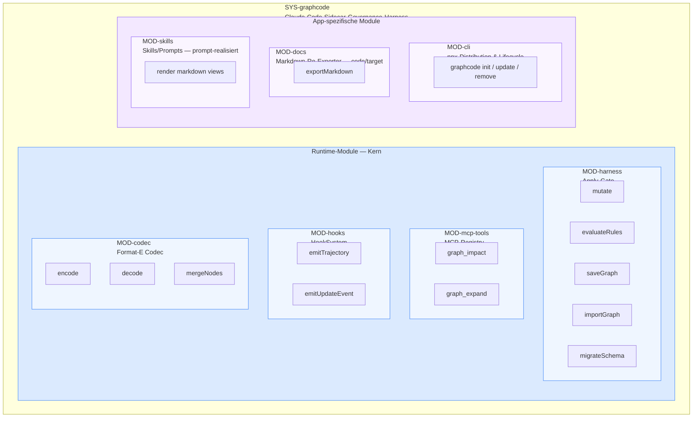
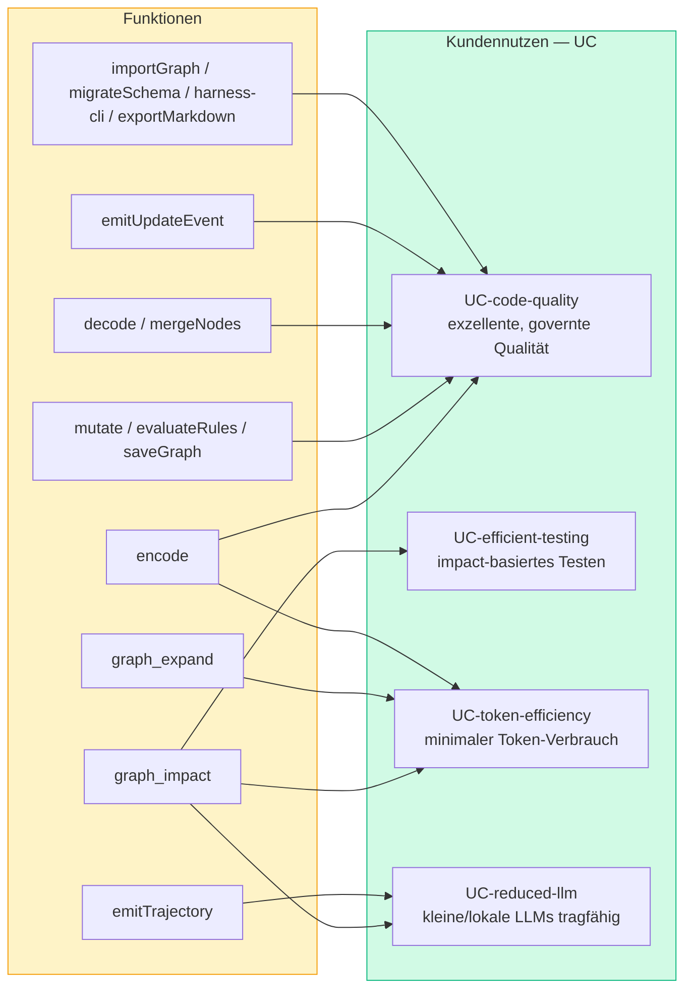
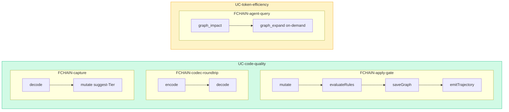
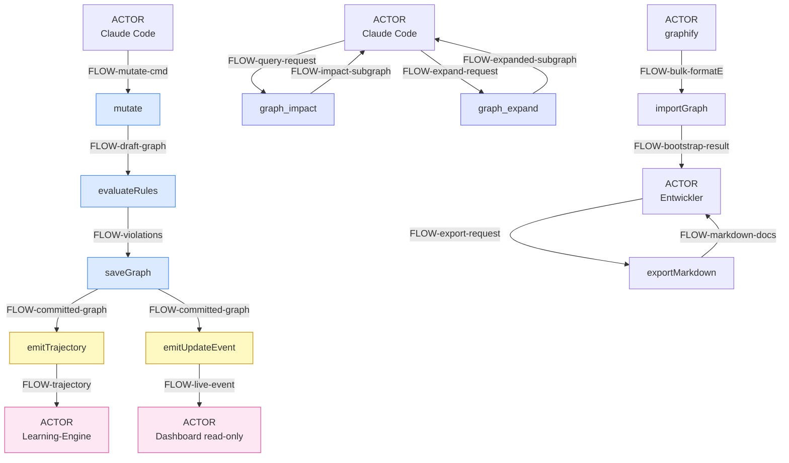

# GraphCode — Architektur-Graph

> ⚠️ **GENERATED aus `docs/graph/graphcode.graph.json` (SSOT)** — Stand 2026-06-17 (156 Elemente / 252 Traces).
> Nicht hand-editieren; bei Modelländerung neu rendern (manueller Vorgriff auf `FUNC-export-markdown` / `UC-doc-export`).
> Layering: UC (Kundennutzen) ← FUNC (satisfy) · UC → FCHAIN → FUNC (compose) · FUNC → FLOW → FUNC (io) · FUNC → MOD (allocate).
>
> **Mermaid-Konvention (sonst rendert nichts):** keine `()` und kein `|` in Node-Labels — Wörter statt `()`, `/` statt `|`; Zeilenumbruch nur via ` `.

## 1. Physische Architektur — Modulstruktur mit Funktionszuordnung

`FUNC -allocate→ MOD`. 4 Runtime-Module (Kern) + 2 app-spezifische Module.

## 2. Kundennutzen — welche Funktion welchen Benefit liefert

`FUNC -satisfy→ UC`. Die 4 Customer-UCs sind das *Warum*; die Funktionen liefern sie.

## 3. Behavioral View — Use-Case-Funktionsketten (FCHAIN)

`UC -compose→ FCHAIN -compose→ FUNC`. Verhaltens-Szenarien pro Nutzen.

## 4. Datenfluss — Funktionen verketten via FLOW

`ACTOR/FUNC -io→ FLOW -io→ FUNC/ACTOR` — es gibt **kein** FUNC→FUNC; der FLOW *ist* die Kante.
Hero = der Apply-Gate-Pfad mit Fan-out zu Dashboard (Ziel b) und Learning-Engine.

> Weitere atomare Daten­flüsse (gleiche `ACTOR→FLOW→FUNC→FLOW→ACTOR`-Form): `merge-nodes` (Branch-Merge),
> `migrate-schema` (Version-Bump), `harness-cli` (init/update/remove). Codec-Round-Trip:
> `Entwickler →FLOW-graph-state→ encode →FLOW-formatE-artifact→ decode →FLOW-parsed-graph→ Entwickler`.

---

**Quelle:** `docs/graph/graphcode.graph.json` · **Generator-Vorbild:** `.claude/skills/se-view-arch.md`
(kopiert aus sirail, API → `GRAPH_API:3001`) · **Realisierung des Renderers:** `FUNC-export-markdown` (UC-doc-export, specced).
