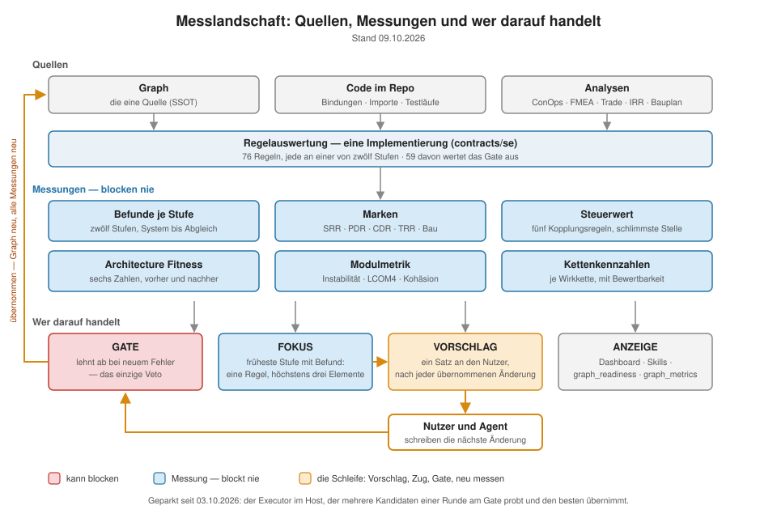

# Kennzahlen — was gerechnet wird, wo, und wer darauf handelt

Die Leitlinie (`docs/graphcode_leitlinie.md`) trägt Claims, DoD und Testdefinitionen. Diese Datei
trägt die **Mechanik**: die Definition jeder Kennzahl, ihre Rechenstelle und den, der darauf
handelt. Den gemessenen Stand je Test-ID schreibt `npm run messung` nach [`stand.md`](stand.md).
Erzählend: `docs/articles/07-the-scoring-landscape.md`.

**Grundsatz:** Für jede Zahl gilt **eine** Definition, **eine** Rechenstelle, **ein** Konsument, der
darauf handelt. Wonach niemand handelt, ist keine Kennzahl und steht hier nicht.

Eine Regelauswertung → vier Projektionen · zwei unabhängige Messfamilien (Topologie) ·
ein abgeleiteter Steuervektor. Handeln dürfen genau drei: **Gate**, **Treiber** (Auswahl → nächster
Prompt), **Anzeige** — dazu die Stufe **Empfehlen** (Leitlinie §3), die als einzige lernen darf.

## Steuergrößen

| Größe | Rechenstelle | Skala / Nenner | Handelt darauf |
|---|---|---|---|
| Regelverstoß | `contracts/se`; `SE_DESCRIPTOR` = SE-Profil | Zählung, `error` blockend | **Gate** (blockt) · **Treiber** (Fundfenster je `rule_id` → Prompt) |
| `completeness` | graphcode-client | covered/total über die **Element**-Population | **Gate** (offen solange < 1) |
| Creation-Freshness | graphcode-client | vorhanden + aktuell | **Gate** |
| `phase_readiness` | graphcode | Regel-IDs ohne offene Verstöße / alle des Gates | **Treiber** (`currentPhaseGate` → offenes Gate des Schritts) |
| `dimension_readiness` (8) | se-steering | `1 − Verstöße / applicable`; `applicable` aus der **Domain-Deklaration je Regel** | **Treiber** (unter Fokus-Schwelle → Fokus; Δ = 1. Rangkriterium) |
| `steeringDelta` | graphcode | Δ je Dimension, vor/nach Kandidat | **Treiber** (Rang 2 + 3) |
| Steuerwert (`steer`, Chebyshev) | se-engine (`STEER_RULES`: RD-04, BW-02, R-04, CR-01, MT-02) | größte Überschreitung einer Steuerregel | **Treiber** (Rangkriterium nach der Zerstörungssperre, CR-GC-483) · Fertig-Kriterium |
| Vorschläge (`graph_suggest`, `next`) | se-engine `suggestEdits` + `FIX_TEMPLATES`, Operatoren | je Befund ein Zug, am Gate geprobt | **Empfehlen** (Agent entscheidet; T-M5) |
| Architecture Fitness ℝ⁶ | se-engine (`fitAdvisory`) | 6 Topologiewerte, ganzer Teilgraph | **Anzeige** — seit CR-GC-483 nur berichtet. Modellarchitektur ist **Nebenbedingung**, nicht Zielgröße (Leitlinie §5); das Vorzeichen ist nicht belegt (T-O4 No-Go) |
| `moduleMetrics` je MOD | `contracts/se/metric-rules` | `[0,1]` / ℕ / `[0,1]`; `null` = nicht messbar | **Anzeige** (Ist gegen Zielwert) · speist MT-01/MT-02 |
| Kettenkennzahlen je FCHAIN | `scripts/spike-kettenkennzahlen.mjs` (Spike) | acht Kennzahlen (Leitlinie §5), heute 5/8 rechenbar | **Anzeige** — noch kein Treiber; Realisierungsarchitektur wird nur an der FCHAIN bewertet (T-O1, T-O2) |
| `functionCriticality` je FUNC | `contracts/se/function-criticality` | ℕ Ketten / ℕ Use Cases; `0` ist eine **Aussage**, kein fehlender Wert | **Anzeige** (Blast Radius, Kritikalität, Rollout); zweiter Abnehmer ist R-21s Infrastruktur-Ausnahme ab CR-SM-313 |
| `compliance` | graphcode-client | Elemente ohne error / alle | **Anzeige** |
| `intentCoverage` | graphcode | je Thema adressiert / nicht | **Treiber** (`isIntentTooThin`, Prompt-Kontext) |
| Retro-KPIs | `scripts/retro-kpi.mjs`, `scripts/cr-messung.mjs` | s. unten | **Skill** `se-retro` · T-E1 in `stand.md` |

## Retro-KPIs — Standardauswertung nach einem Projekt (CR-GC-212)

Misst, ob der Graph tatsächlich benutzt wurde (nicht per grep umgangen) und ob das Gate die
Qualität gehoben hat. KPI 1–6 rechnet `scripts/retro-kpi.mjs` (Logik in `tests/retro-kpi.test.ts`),
aufgerufen über den Skill `se-retro`; KPI 7 `scripts/grenzmenge.mjs`, erhoben in `npm run messung` (T-V4); KPI 1 je CR zusätzlich automatisch nach jedem Commit
(`scripts/cr-messung.mjs` → `.graphcode/cr-messung.jsonl`). Quellen: MCP (Audit- und Readiness-Werkzeuge),
git und das Sitzungsprotokoll — nie ein zweiter DB-Handle.

| KPI | Definition | Quelle | Kriterium |
|---|---|---|---|
| **1 Graph gegen Grep** | `graph_*`-Leseaufrufe ÷ (Grep + Glob + Doc-Read) im Fenster ab der CR-ID; Lesen von `docs/graph`, `docs/views`, `.graphcode` zählt als Suche | Sitzungsprotokoll | **keine Schwelle** (T-E1): jede Suche, die der Graph beantwortet hätte, ist als Potenzial ausgewiesen. Der Gewinn des Graphen ist Präzision, nicht Geschwindigkeit |
| **2 Werkzeugnutzung** | Zahl der Aufrufe `graph_mutate` / `graph_impact` / `graph_expand` / `rules_evaluate` | `audit_trail`, Protokoll | — (Profil) |
| **3 Tokens je Netto-LOC** | Tokens ÷ (eingefügt − gelöscht) | Protokoll + `git diff` | ↓ |
| **4 Plantreue** | Zahl der CRs, die ihre `depends-on`-Reihenfolge verletzen | Graph + CR-Daten (`deriveImplPlan`, CR-GC-209) | **0** |
| **5 Gate-Gesundheit** | angewandt ÷ abgelehnt, dazu Readiness-Δ Start → Ende | `audit_stats`, `graph_readiness` | — / ↑ |
| **6 Bindung (Knoten)** | R-19 / R-20 (`testRefs` / `realRef`) zum Abschluss | `rules_evaluate` | **100 %** (T-V4: Bindungsquote) |
| **7 Bindung (Grenzmenge)** | FUNC/SCHEMA, die eine MOD-Grenze kreuzen, im Modell ÷ Pflichtmenge | `scripts/grenzmenge.mjs` | **100 %** (T-V4). Alles unterhalb der Grenze bleibt Blackbox — „jede Datei im Modell" ist **kein** Ziel |

**Warum Bindung zweimal.** R-19/R-20 sind Regeln je Element: sie prüfen die Knoten, die es gibt, und
sehen nicht, was nie modelliert wurde. Am eigenen Repo lasen sie 0 Befunde (KPI 6 = 100 %), während
nur 48 von 106 Testdateien und 19 von 63 Quelldateien überhaupt einen Knoten trugen
(SPIKE-GC-selective-tests, 2026-08-21). Die Knotenseite sagt *das Modell ist in sich vollständig*,
die Grenzmenge sagt *das Modell deckt, was die Architektur trägt*. `scripts/test-selection-audit.mjs`
misst weiter die Datei-Deckung aller Tests — als Reichweite der Testauswahl (T-E7), nicht als Ziel.

**Warum diese.** Die erste echte Anwendung (graphify) hinterließ Anzeichen einer Umgehung — ein nie
exportiertes 231-KB-`kuzu.wal`, kein committetes `graph.json`, die CR-Reihenfolge als Prosa in
`CLAUDE.md` —, aber messbar war es nicht, weil es keine KPI gab.

## Läufe des Rigs — ein Datensatz je Lauf (CR-GC-739)

Rig und Auswertung leben seit CR-GC-764 im privaten Repo graphanalyze. Was ein Lauf des Rigs war, steht dort als
Datensatz in `docs/messung/benchmark.jsonl` und gerendert in `benchmark.md`; die Größen und ihre Eingänge definiert
dort `auswertung/README.md` (Kennzahlen, Verhalten, Schatten-Vorschläge, Blindurteil).
Eine Größe davon bleibt hier, weil die Leitlinie sie als Test führt:

| Größe | Definition | Kriterium |
|---|---|---|
| Dubletten | neuer Knoten mit ≥ 70 % Wortgleichheit (gleicher Name: ≥ 40 %) zu einem Knoten desselben Typs, je Kommando, jeder Typ; Schablonentext getrennt | Leitlinie T-E11 |

Die Executor-Züge der S2-Runden (Lösungsquote je Fokusregel, neue Fokusfunde, Regel-Pareto; CR-GC-708/709) sind
mit dem Greenfield-Rig gefallen (CR-GC-740); ihre Definitionen und der Kennzahlverlauf liegen unter
[`docs/archive/messung-executor/`](../archive/messung-executor/verlauf.md).

## Schwellen — zwei Ebenen, nie im Code

Keine Urteilsschwelle steht als Literal im Regelcode. Sie steht auf einer von zwei Ebenen, und die
Zuordnung entscheidet, **wer sie ändern darf**:

| Ebene | Inhalt | Wer setzt sie | Charakter |
|---|---|---|---|
| **1 — Verfahren** (graphcode) | Maße des Messgeräts: ND-Ähnlichkeit, BQ-04-Ähnlichkeit, Schema-Overlap; die unvalidierten Startwerte von MT-01/MT-02, CR-01, R-04 | mit dem Werkzeug ausgeliefert, versioniert | **Startwerte**, nicht durch Messreihen belegt. Änderung = Messgerät ändern, gehört in eine Release-Notiz |
| **2 — Zielarchitektur** (Projekt) | Was dieses Projekt erreichen will: Instabilität, LCOM4, Crossing Flows, Fokus-Schwelle, Risiko-RPN, Randbreite (Modul wie Whitebox), Zerlegungsbreite, Infrastruktur-Schwelle | der Mensch, je Repo | **Ziel**. Änderung = Anspruch ändern, gehört ins Projektprotokoll |

Beide liegen in `graphcode.config.jsonc`, getrennt ausgewiesen. `null` heißt auf beiden Ebenen
„messen, nicht urteilen" — und ist auf Ebene 1 der Weg, einen unbelegten Startwert loszuwerden,
ohne die Zahl zu verlieren. Jede Schwelle verlässt den Host **mit** der Größe, über die sie urteilt.

## Drei Sätze, die das Diagramm nicht zeigt

- **Regeln sehen keine Abwesenheit.** Eine Regel je Element feuert bei null Elementen null mal —
  `completeness` ist die einzige Projektion, die „fehlt komplett" messen kann.
- **`dimension_readiness` ist keine zweite Achse zu den Verstößen**, sondern deren thematische
  Verdichtung. Unabhängig davon sind nur `moduleMetrics` und die Topologie (ℝ⁶).
- **Zwei Wörter „Kohäsion":** `cohesion` (LCOM4) misst Kanten innerhalb der *erklärten* Modulgrenze
  (in flow-geführten Architekturen nahe 0 → bewusst schwellenlos), ℝ⁶-coherence misst
  *algorithmisch gefundene* Cluster. Zwei Fragen, ein Wort.

## Eine Schwelle je Frage

„Ist diese Dimension zu schwach?" wird genau einmal beantwortet — von der Fokus-Schwelle aus der
Config. Ein zweiter Wert für dieselbe Frage (ein `ready`-Flag neben einer Generator-Schwelle) ist
per Definition ein Widerspruch, kein Komfort.

## Gestrichen: was keinen Konsumenten hat

`overallScore` (Mittel über gestartete Dimensionen), das `ready`-Flag und der Gewichtsvektor D1–D6
werden gerechnet und von nichts gelesen — kein Gate, kein Treiber, keine Anzeige. Sie sind Reste des
aimprove-Prompt-Scorers. Entweder bekommt eine davon einen handelnden Konsumenten, oder sie fällt
(CR-SM-233 · CR-SM-235 · CR-GC-329).

Zusammengeführt aus `docs/KPI.md` und `docs/MESSGROESSEN.md` (CR-GC-680).

@author andreas@siglochconsulting
