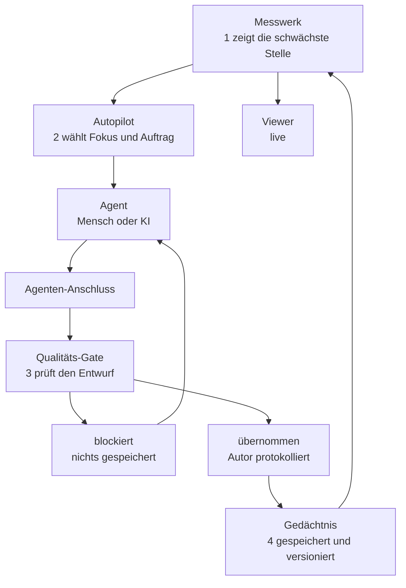
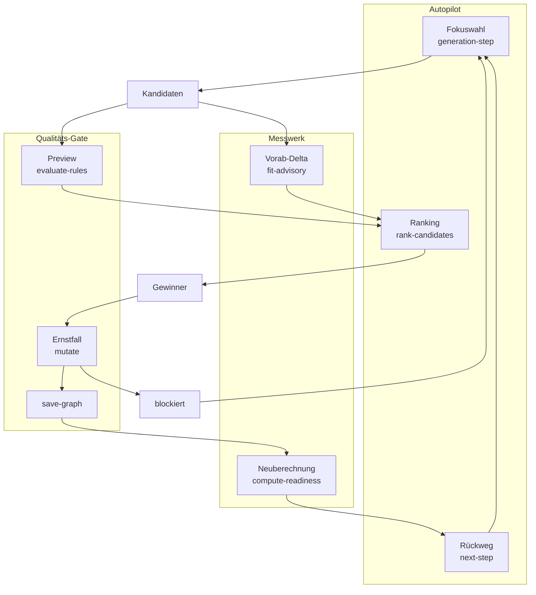
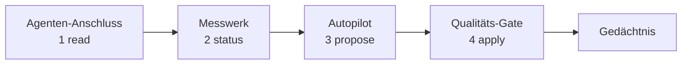
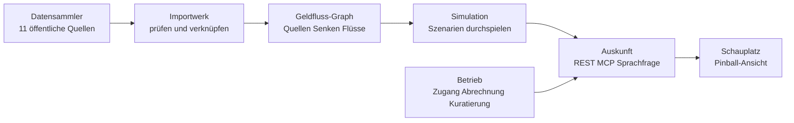

# SPIKE-GC-abstraction-levels — Ergebnisse

**Runde 1 (2026-08-16):** Testcase 1 — Blockschnitt entworfen, Vergleichsurteil positiv
(„sieht gut aus"), **durchs Gate geschrieben und exportiert** (v98 → v101). Messung in §5.

---

## 1. Ebene 0 — sechs Blöcke (Substantiv-Wording, Sales)

| Block | Sales-Satz | Blatt-FUNCs |
|---|---|---|
| **Qualitäts-Gate** | Jede Änderung — von Mensch oder KI — geht durch dieselbe Prüfung; illegal wird nie gespeichert | 4 |
| **Messwerk** | Kennzahlen aus dem Modell selbst: Reifegrad, Phasen-Gates, Architektur-Fitness — live, ohne KI | 8 |
| **Autopilot** | Wählt die schwächste Stelle, lässt Kandidaten antreten, stößt die nächste Runde an | 4 |
| **Agenten-Anschluss** | Der Arbeitsplatz des Coding-Agenten: präzise Fragen statt Volltextsuche | 9 |
| **Schaufenster** | Live-Dashboard und fertige Ingenieurs-Dokumente — immer aktuell, nie von Hand gepflegt | 19 |
| **Gedächtnis** | Das Modell als Text-Artefakt: versioniert, wiederherstellbar, zusammenführbar | 10 |

Deckt die Baseline-Legende exakt: **RULE = Qualitäts-Gate, KPI = Messwerk, DRIVER = Autopilot**
(candidate-flow.svg definiert genau diese drei Rollen).

### Zuordnung aller 55 FUNCs

| Block | Mitglieder |
|---|---|
| Qualitäts-Gate | mutate, evaluate-rules, save-graph, check-code-conformance |
| Messwerk | take-steering-snapshot, compute-readiness, compute-phase-readiness, compute-steering-delta, score-completeness, arch-fitness, module-metrics, fit-advisory |
| Autopilot *(= bestehender `FUNC-goal-steerer`)* | generation-step, next-step, rank-candidates, graph-suggest |
| Agenten-Anschluss | serve-stdio, graph-expand, graph-impact, deduce-tests, resolve-tests-from-code, harness-cli, health-endpoint, test, test-ui |
| Schaufenster | serve-sse, subscribe-updates, broadcast-diff, emit-update-event, render-health, render-graph, render-impact, render-readiness, render-impl-gates, render-artifacts, render-recommendations, render-views, export-markdown, view-changelog, view-conops, view-icd, view-intplan, view-irr, view-rtm |
| Gedächtnis | decode, encode, import, merge-nodes, graph-export-snapshot, reseed, rewind, migrate-schema, emit-trajectory, own-kuzu-host |

54 Blätter + goal-steerer als Block = 55. ✓

**Ebene 1:** bei fünf Blöcken sind die Blätter selbst die Ebene 1. Nur das Schaufenster (19)
bekommt eine Zwischenstufe: **Live-Dashboard** (serve-sse, subscribe-updates, broadcast-diff,
emit-update-event, render-*) und **Dokumentenwerk** (export-markdown, render-views, view-*).

### Erforderliche Mutationen (wenn bestätigt)

1. 5 neue Ebene-0-FUNCs anlegen (Gate, Messwerk, Anschluss, Schaufenster, Gedächtnis) +
   2 Ebene-1-FUNCs (Live-Dashboard, Dokumentenwerk); `FUNC-goal-steerer` wird umbenannt/
   umbeschrieben zum Block „Autopilot" — kein neuer Knoten, kein Umhängen
2. ~54 `FUNC compose FUNC`-Kanten (add-only, ein Batch je Block)
3. **Ein Delete, separater Batch:** `FUNC-goal-steerer compose FUNC-mutate` — mutate gehört zum
   Gate; die Nutzung durch die Schleife bleibt über `FCHAIN-steering-loop` sichtbar (Ketten
   referenzieren über Blockgrenzen, das ist ihr Zweck)
4. Ebene-0-Blöcke haben keinen SYS-Parent (`SYS compose FUNC` ist kein TRACE_PATTERN) — sie sind
   FUNC-Wurzeln; dryRun-Verdict entscheidet, ob das eine Regel reißt

**Strittige Zuordnungen (Fachurteil, bewusst so):** decode/encode im Gedächtnis statt im Gate
(sie sind die Sprache des Artefakts, nicht die Prüfung); emit-trajectory einsortiert obwohl
konsumentenlos (Streichung ist Review-Maßnahme 4, nicht Spike-Scope); own-kuzu-host als
Infrastruktur des Gedächtnisses.

---

## 2. Rollup-Renders (von Hand, Vorgriff auf projectDepth)

### 2.1 Regel-KPI-Schleife — Ebene 0 (Baseline: rule-kpi-loop.svg)

### 2.2 Candidate-Flow — Ebene 1, Autopilot aufgeklappt (Baseline: candidate-flow.svg)

### 2.3 Advisory-Roundtrip — Ebene 0 (Baseline: Artikel 05)

---

## 3. Vergleich gegen die Baseline (Runde 1, Vorab-Einschätzung)

| Grafik | modellabgeleitet | Einschätzung |
|---|---|---|
| rule-kpi-loop.svg | §2.1 | Die vier nummerierten Schritte und beide Ausgänge (blockiert/übernommen) sind abgebildet; die Baseline trägt zusätzlich Live-Zahlen („36 Funktionen ohne Code-Bindung") — die kämen im Modell-Render aus `graph_readiness`, also *besser*: nie stale |
| candidate-flow.svg | §2.2 | RULE/KPI/DRIVER-Legende = Blockschnitt; Preview-vs-Ernstfall-Unterscheidung bleibt erhalten |
| phase-gates / measurement-landscape / aspice-coverage | — | keine Wirkketten, sondern Kennzahl-Tableaus — Gegenstück ist das Schaufenster selbst, nicht ein Rollup; aus dem Vergleich ausgenommen (Begründung dokumentiert) |

**Urteil steht aus** (Abnahme §4 des Spike-Docs): das Vergleichsurteil je Grafik ist Fachurteil
des Betreibers, nicht der Vorab-Einschätzung.

## 4. Nächste Schritte

1. ~~Vergleichsurteil~~ — bestätigt 2026-08-16
2. ~~Gate-Write + Export + Nachmessung~~ — erledigt, §5
3. Testcase 2 (graphify-Import eines Fremd-Repos)
4. Offen aus §5: die 7 R-02-Warnings der Blöcke — satisfy-Kanten Block→UC sind Fachurteile
   (z. B. Qualitäts-Gate satisfy UC-code-quality), eigener kleiner Batch

## 5. Gate-Write Runde 1 — Messung (2026-08-16)

**Drei Batches durchs Gate** (dryRun-Verdict vorab: tier suggest, 0 Errors):

| Batch | Inhalt | graphVersion |
|---|---|---|
| formatE, 60 Kommandos | 7 Blockknoten + 53 compose-Kanten | 98 → 99 |
| update-node | `FUNC-goal-steerer` → Name „Autopilot", Blockbeschreibung | 99 → 100 |
| delete-edge (separat, Reihenfolge-Falle) | `goal-steerer compose mutate` raus | 100 → 101 |

**Struktur verifiziert am Export** (534 Knoten / 1211 Kanten):
56 `FUNC compose FUNC`-Kanten · **0** FUNCs mit mehr als einem FUNC-Elternteil ·
**genau 6 FUNC-Wurzeln = die sechs Ebene-0-Blöcke.** ✓

**Architecture-Fitness — der Blockschnitt bewegt vier von sechs Komponenten deutlich:**

| Komponente | vorher | nachher | Δ |
|---|---|---|---|
| faultTolerance | 2.679 | 4.082 | **+1.40** |
| flowEfficiency | 0.106 | 0.712 | **+0.61** |
| scalability | 3.328 | 3.853 | **+0.53** |
| coherence | 4.100 | 4.144 | +0.04 |
| viability | 4.893 | 4.898 | +0.01 |
| modifiability | 3.291 | 3.272 | −0.02 |

**Readiness:** compliance 0.734 → 0.738; `arch` 0.988 → 0.985 und `alloc` 0.937 → 0.873 durch
die erwarteten R-02/R-22-Warnings der 7 Blockknoten (logische Blöcke ohne satisfy/allocate —
R-02 per satisfy-Kanten schließbar, s. §4; R-22 ist für Abstraktionsknoten diskutabel: ein
Ebene-0-Block gehört bewusst keinem MOD). Übrige Dimensionen unverändert.

**Beobachtung für die projectDepth-Folge-CRs:** das Nesting ist jetzt Datenlage — die
Rollup-Renders in §2 sind ab sofort aus dem Graphen ableitbar statt von Hand gepflegt.

---

## 6. Runde 2 (2026-08-16) — Review-Feedback eingearbeitet (v101 → v104)

**Drei Änderungen aus dem Betreiber-Review:**

1. **Ebene-0-MOD eingezogen:** `MOD-repo-root` („graphcode Projektwurzel") — SYS komponiert nur
   noch die Wurzel, die Wurzel komponiert alle 10 Module (**MOD-in-MOD jetzt real: 10 Kanten,
   vorher 0**). Die fünf Ebene-0-Blöcke allokieren auf die Wurzel, die Ebene-1-Blöcke auf ihre
   echten Module (Live-Dashboard→MOD-dashboard, Dokumentenwerk→MOD-docs, Autopilot-Kinder→
   MOD-steering). Damit sind alle R-22-Warnings der Blöcke aufgelöst.
2. **Schaufenster → „Viewer"** (für Dokumente, Architektur, Reifegrad) — uid bleibt
   `FUNC-block-schaufenster`, nur Name/Beschreibung.
3. **Autopilot bekommt die Prozess-Steuerung als Ebene 1** — drei Teilaspekte:

   | Ebene-1-Block | Blätter |
   |---|---|
   | **Q-Improvement** — Fehler & Warnings | next-step |
   | **Architektur-Optimierung** — R⁶-Operatoren | graph-suggest |
   | **SE-Prozess-Steuerung** — readiness-getriebener Rundenschritt | generation-step, rank-candidates |

   **Befund dabei:** die SE-Prozess-Skills (se-plan, se-status, se-review, se:generate,
   se:close-violations) sind **nicht als FUNC modelliert** — nur test/test-ui und die
   view-Skills sind es. Der vermisste Steuerungs-Aspekt war also real eine Modelllücke; die
   drei Blöcke geben ihm jetzt den Platz, die Skill-FUNCs nachzuziehen ist Modell-
   Vervollständigung (Runde 3), kein Refactoring.

**Struktur verifiziert:** 59 FUNC-compose-Kanten · 0 Doppel-Eltern · 6 FUNC-Wurzeln ·
MOD>MOD 10 · SYS→MOD nur noch die Wurzel. Warnings: 3× R-02 (neue Blöcke), R-04/MT-02 an
MOD-steering (11 FUNCs, hohe Kopplung — ehrlicher Befund, kein Artefakt).

**Fitness über beide Runden** (arch-Layer):

| Komponente | Start | nach R1 | nach R2 |
|---|---|---|---|
| faultTolerance | 2.679 | 4.082 | **4.603** |
| flowEfficiency | 0.106 | 0.712 | **0.830** |
| coherence | 4.100 | 4.144 | 3.986 |
| modifiability | 3.291 | 3.272 | 3.122 |
| scalability | 3.328 | 3.853 | **2.987** |

**Ehrlicher Befund zu den Zielvektoren:** die Wurzel-MOD kostet `scalability` −0.84 — die
Zentralisierung konzentriert Betweenness auf einen Hub. Das ist genau die Antwort auf die
Frage »geben die Zielvektoren das her?«: sie *reagieren* auf die Abstraktionsstruktur, und
nicht jede gewollte Abstraktion verbessert jede Komponente. Für Schritt 3 heißt das: die
Vektoren können ein Ziel-Redesign bewerten, aber Ebene-0-Hubs muss man dabei als bewussten
Preis lesen (oder die Messung auf Blattebene projizieren, nicht über Abstraktionsknoten).

### 6.0 Potential: die Fitness sah es, niemand empfahl es (Pareto-Front als eigener Prozess)

Die R⁶-Vektoren sind auf genau diese FUNC-to-FUNC-Struktur ausgelegt und haben den
Blockschnitt sofort honoriert (+1.40 faultTolerance lag die ganze Zeit »auf der Straße«) —
aber **kein `graph_next_step` hat je empfohlen, die Abstraktionsebene einzuziehen.** Ursache:
die Empfehlungsseite ist regel-/readiness-getrieben (`graph_suggest` rankt nur Operatoren zu
feuernden Regeln, FIX_TEMPLATES), und keine Regel sieht die *Abwesenheit* einer
Abstraktionsebene — dieselbe Klasse wie »Regeln sehen keine Abwesenheit«, nur auf der
KPI-Achse: **gemessen wurde es, empfohlen hat es niemand.**

**Vermerktes Potential:** strukturelle Fitness-Kandidaten (Ebene einziehen, Block teilen,
Hub auflösen) als **separat getriggerte Pareto-Front-Analyse** analog zum IRR-Prozess
(se-irr: bewusst ausgelöst, Befunde gepinnt, die tragenden zu CRs promoted) — nicht in jeder
next_step-Runde. Pareto statt Skalar ist hier zwingend: die Komponenten traden nachweislich
gegeneinander (Wurzel-MOD: +faultTolerance / −scalability, §6) — ein Einzelscore würde den
Konflikt verstecken, die Front zeigt die nicht-dominierten Strukturzüge und lässt das Urteil
beim Menschen. Eigener CR nach Spike-Abschluss.

### 6.1 Ehrliche Antwort: würde man den Candidate-Flow so designen?

**Nein, nicht mit dieser Verdrahtung.** Das Hin und Her in §2.2 ist echt (der
Advisory-Roundtrip-Spike hat die 4 Aufrufe je Runde gemessen), und die Hälfte davon ist
historisch, nicht essenziell: Regel-Preview und Fitness-Delta sind **zwei** Aufrufe je
Kandidat, wo **einer** reicht (»bewerten«: Verdict + Δm in einer Antwort). CR-GC-352 ist
schon auf diesem Weg — `verdict.fitDelta` steckt seit dort in der Gate-Antwort, vorher
wurde die Zahl weggeworfen.

**Zielszenario (Schritt 3, nicht jetzt):** Autopilot → *ein* Bewertungsaufruf je Kandidat →
Ranking → *ein* Commit des Gewinners. Reduziert die sichtbaren Linien von ~9 auf ~5.
**Vorbedingung für den Zielvektoren-Check:** die Schleifen-Kanten in §2.2 sind heute
FCHAIN-Mitgliedschaften, keine modellierten FLOWs — damit die R⁶-Fitness ein Redesign
bewerten kann, müssen die Flüsse der Schleife erst als FLOW-Knoten ins Modell. Erst
modellieren, dann messen, dann refactorn.

---

## 7. Testcase 2 — moneyflow per graphify importiert (2026-08-16, Runde 1)

**Repo:** `dev/moneyflow` („Finance Pinball – Geldfluss-Simulation als gerichteter Graph").
Import über den echten Produktpfad `graphcode import-code` → eigener Store in moneyflow,
Gate-only, Reseed-Semantik. **1228 Knoten / 966 Kanten:** FUNC 306 · FLOW 220 · SCHEMA 122 ·
TEST 425 · MOD 155 (eine MOD je Datei).

### 7.0 Beifang: echter graphify-Bug in Minute 2

`extractCodeRepoPipeline` → `parseFile` übergibt Dateiinhalte als plain String an tree-sitter;
dessen Node-Binding wirft **„Invalid argument" für Strings > 32 KiB** — der ganze Import
stirbt an einer Datei. moneyflow hat zwei davon (`import/cross-source-linker.ts` 46 KB,
`frontend/components/PinballCanvas.tsx` 33 KB). **Workaround im Spike:** 155/157 Dateien
importiert, die zwei ausgeschlossen — kein stiller Cap, hier notiert. **Fix gehört nach
graphify** (Buffer-/Callback-Parse statt String), eigener CR im graphify-Repo.

### 7.1 Ebene-0-Schnitt (7 Blöcke, Substantiv-Wording, aus den Top-Verzeichnissen)

| Block | Quelle (FUNCs) | Sales-Satz |
|---|---|---|
| **Datensammler** | crawlers (18) | Holt öffentliche Finanzdaten: Bundeshaushalt, Bundesbank, Destatis, Eurostat, EDGAR … |
| **Importwerk** | import, transformers, schemas (59) | Prüft Rohdaten und verknüpft Quellen zu einem Bild |
| **Geldfluss-Graph** | core (36) | Das Herz: Quellen, Senken, Flüsse — mit Konfidenz je Kante |
| **Simulation** | simulation (11) | Der „Pinball": Szenarien durchspielen, Wirkungen verfolgen |
| **Auskunft** | api, mcp, llm (64) | Antworten über REST, MCP und natürliche Sprache |
| **Schauplatz** | frontend (57) | Die Pinball-Ansicht: Geldflüsse sichtbar in Bewegung |
| **Betrieb** | auth, billing, ops, cli, content (61) | Zugang, Abrechnung, Betrieb, Kuratierung |

306 FUNCs vollständig zugeordnet. Ebene 1 = die Top-Verzeichnisse selbst (z. B. Auskunft →
api/mcp/llm) — die Verzeichnisstruktur der App IST bereits eine brauchbare Ebene 1; der
Schnitt oben ist reines Zusammenfassen, kein Umsortieren.

### 7.2 Kern-Wirkkette Ebene 0

Belegt aus den importierten FLOWs (Beispiele): `compare-Route → simulation/snapshot-diff`,
`admin-Route → auth/revocation`, `extern-Route → user/api-key-scope` — die Kette oben ist
Rollup echter Kanten, nicht Prosa.

### 7.3 Prinzip-Thema (Kalt-Leser-Test) + Befunde

**These aus der Struktur:** *Öffentliche Geldflüsse als gerichteter Graph — einsammeln,
verknüpfen, durchspielen, befragen.* Die Struktur trägt die Erklärung ohne Code-Lektüre —
und die Pointe: das Fremd-Repo ist strukturverwandt mit graphcode selbst (Graph-Kern,
kuratierter Schreibpfad in `content/cr-lifecycle`, MCP-Auskunft).

**Ehrliche Befunde des Imports:**
1. **Eine MOD je Datei ist zu fein für Ebene 1** — 155 MODs; die Verzeichnis-Ebene fehlt dem
   Import. Potential für graphify/import-code: MOD-Nesting aus der Verzeichnishierarchie
   gleich mitliefern (`mod_api` compose `mod_api_routes_*`), dann wäre Ebene 1 geschenkt.
2. **Testdateien werden MOD+FUNC** (`mod_api_api_test_ts`, `func_..._makemockgraphservice`)
   und zugleich existieren 425 TEST-Knoten — die Trennung Test-Artefakt vs. Produktions-MOD
   ist unscharf; für Übersichtsebenen müssten `*_test_ts`-MODs herausprojiziert werden.
3. Der Grouping-Gate-Write in moneyflows Store steht aus (gleicher Loop wie Testcase 1:
   erst Urteil, dann Write).

### 7.4 Stand / offen

- [x] Import durch den Produktpfad, Zahlen oben; moneyflow-Store existiert (`.graphcode/`),
      Export `docs/graph/moneyflow.graph.json` — dort **uncommitted**
- [ ] Vergleichsurteil Betreiber: erklärt 7.1/7.2 die App einem Kalt-Leser (besser/
      vergleichbar/schlechter als README/Artikel)?
- [ ] Bei Bestätigung: Block-FUNCs + compose durchs Gate in moneyflows Store (eigene Session
      dort, wie GVE-230-Muster)
- [x] graphify-CR: 32-KiB-tree-sitter-Limit → **CR-GF-140**
- [x] graphify-CR: Verzeichnis-Nesting + Testdatei-Policy → **CR-GF-141**

---

## 8. Runde 3 (2026-08-16, v104 → v107) — Viewer-Trias + Skills als FUNC

**Viewer-Ebene-1 entlang der Namens-Trias** (statt nach Mechanik): **Dokumentenwerk** ·
**Architektur-Sicht** (render-graph, render-impact) · **Reifegrad-Sicht** (render-readiness,
impl-gates, artifacts, recommendations, health) · **Live-Kanal** (nur Transport: sse,
subscribe, broadcast, emit — umbenannt aus Live-Dashboard).

**15 Skill-FUNCs modelliert** (die verlorene Diskussion ist jetzt Modellstand), alle mit
`realRef` auf ihre Skill-Datei (`.claude/skills/<name>.md`, lang `prompt` — Konvention von
FUNC-view-icd) und `allocate → MOD-skills`:

| Block | Skill-FUNCs |
|---|---|
| SE-Prozess-Steuerung | se-status, se-review, se-plan, se-retro, se-conops, se-fmea, se-irr, se-trade, se-generate |
| Q-Improvement | close-violations |
| Agenten-Anschluss | author-uc, author-req, import-doc, se-help, target-profile |

**Struktur verifiziert:** 76 FUNC-compose · 0 Doppel-Eltern · 6 Wurzeln (555 Knoten / 1260
Kanten).

**Ehrliche Warnlage danach:** R-04/MT-02 an MOD-skills (24 FUNCs, LCOM4 17 — der
Skill-Katalog ist als EIN Modul modelliert, real sind es unabhängige Prompts); RD-04 am
Agenten-Anschluss (14 Kinder > 11 — Kandidat für eine Ebene „Autorenwerkzeug" in Runde 4);
15× R-02 (Skills ohne satisfy — die Skill→UC-Zuordnung ist Fachurteil, offen wie die
Block-satisfies aus §4).

**Welche Tests haben die Skills?** (Frage aus dem Review) — Stand heute:
1. **Strukturell, kollektiv:** `TEST-skills-mcp` → `tests/skills.mcp-conformance.test.ts` —
   prüft jedes Skill-Vokabular gegen die live Ontologie + Tool-Registry; hat bei contracts
   4.0 zwei gedriftete Skills gefunden (CR-GC-338). Plus `TEST-scaffold-skills`
   (Installation via CLI).
2. **View-Skills:** de-facto über die Determinismus-Tests des CR-GC-220-Exporters — der
   Skill ist ein dünner Trigger.
3. **Verhalten je Skill: nur Rig-Läufe** (`rig/greenfield-systemtest`), nicht CI. Ein
   Prompt hat kein Red-First-Äquivalent in der Suite — dieselbe Lücke, die se-test-ui für
   UI schloss, ist für Skills offen. Wenn das mehr sein soll als ein Vermerk: eigener CR
   (Skill-Verhaltens-Fixtures im Rig, versioniert je Ontologie-Stand).

@author andreas@siglochconsulting

@author andreas@siglochconsulting
