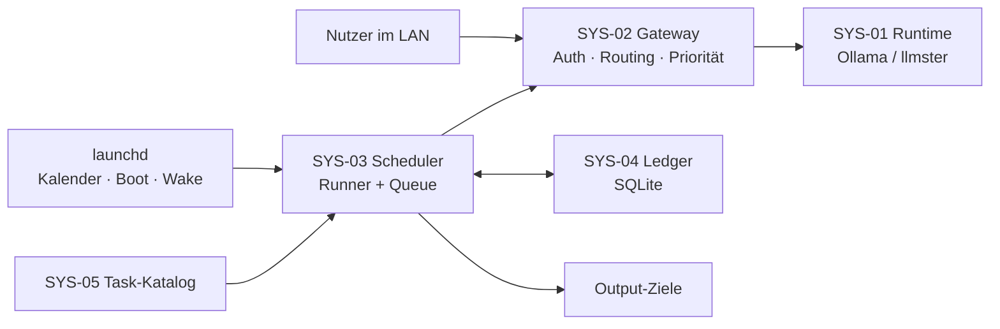

# SIG Local – Projektdefinition

| Feld | Wert |
| --- | --- |
| System | SYS-00 SIG Local |
| Status | Entwurf |
| Stand | 2026-09-17 |
| Owner | Andreas |

Lokale LLM-Compute-Plattform für das interne Netz: eine Headless-Runtime, die Nutzer interaktiv bedient und nachts einen Hintergrund-Agentenloop ausführt. Keine Cloud-Abhängigkeit.

---

## 1. System

### 1.1 Systemkontext

### 1.2 Systemdekomposition

| ID | System | Verantwortung |
| --- | --- | --- |
| SYS-00 | SIG Local | Gesamtsystem |
| SYS-01 | Runtime | Modelle laden/entladen, Inferenz; gemeinsamer Dienst für UC-01 und UC-02; nur localhost |
| SYS-02 | Gateway | Einziger API-Zugang: Token-Auth, Profil → Modell, Priorität nach Konsument und Tageszeit, Metriken |
| SYS-03 | Scheduler | Trigger (launchd) und Runner: Fälligkeit, Queue, Agentenloop, Validierung, Benachrichtigung |
| SYS-04 | Ledger | Soll-Slots, Ist-Läufe, Zwischenzustände, Run-Log, Metriken |
| SYS-05 | Task-Katalog | Deklarative Agent-/Task-Definitionen: Zeitplan, Profil, Tools, Schrittlimit, Prompt-Template, Output-Schema, Ziel, Catch-up-Policy, Laufbedingungen |

### 1.3 Akteure

| ID | Akteur | Rolle |
| --- | --- | --- |
| ACT-01 | Nutzer im internen Netz | Nutzt LLM-Compute über SIG Local |
| ACT-02 | Andreas unterwegs | Nutzt lokale Instanz auf dem MacBook |
| ACT-03 | launchd | Löst den Scheduler aus |
| ACT-04 | GitHub | Quelle für Aktivitätsdaten |
| ACT-05 | Websites und Server | Prüfobjekte des Health Checks |
| ACT-06 | Benachrichtigungskanal | Empfängt Fehler und Befunde (offen) |

### 1.4 Zielplattform und Betriebsmodi

| Modus | Host | Erreichbar für | Endpoint |
| --- | --- | --- | --- |
| Phase 1 – internes Netz | MacBook Pro, 64 GB | alle Nutzer im internen Netz | SIG Local (Gateway, LAN) |
| Phase 2 – internes Netz | Mac Mini (Spezifikation offen) | alle Nutzer im internen Netz | SIG Local (Gateway, LAN) |
| Unterwegs | MacBook Pro | nur MacBook | localhost |

- Phase 1: SIG Local ist nicht verfügbar, sobald das MacBook das Netz verlässt.
- Phase 2: Das MacBook nutzt im internen Netz SIG Local auf dem Mac Mini.
- Betriebssystem macOS, Scheduler nativ über launchd.

### 1.5 Scope

**In Scope:** Headless-Inferenz als gemeinsamer Dienst, Gateway, deklarativer Task-Katalog, Scheduler mit Catch-up, zwei Modellprofile (`reasoning`, `fast`), Run-Log, Metriken, Benachrichtigung.

**Out of Scope:** Web-UI zur Task-Verwaltung, Zugriff aus dem Internet, Cloud-Fallback.

---

## 2. Use Cases

| ID | Use Case | Akteur | Zeitraum | Priorität | Lastprofil | Systeme |
| --- | --- | --- | --- | --- | --- | --- |
| UC-01 | LLM-Compute bereitstellen | ACT-01 | ganztägig, Schwerpunkt Tag | hoch am Tag | interaktiv, niedrige Latenz | SYS-01, SYS-02 |
| UC-02 | Agentenloop im Hintergrund betreiben | ACT-03 | Schwerpunkt Nacht, Catch-up | hoch in der Nacht | mehrstufig, lange Kontexte | SYS-01 bis SYS-05 |
| UC-03 | Lokal arbeiten unterwegs | ACT-02 | bei Abwesenheit vom internen Netz | – | interaktiv | SYS-01, SYS-02 |

### 2.1 UC-02-Instanzen (Migration aus Claude Desktop)

Zwei bestehende Scheduled Tasks laufen in der Claude-Desktop-Umgebung nicht zuverlässig und werden als erste Tasks übernommen. Sie sind zugleich Abnahmefälle für SYS-03.

| ID | Task | Profil | Input | Output | Zeitplan | Laufbedingung | Catch-up |
| --- | --- | --- | --- | --- | --- | --- | --- |
| UC-02.1 | Tagebuch: GitHub-Aktivitäten zusammenfassen (`daily-coding-leistungsnachweis`) | `fast` | GitHub-Aktivitäten des Vortags (lesend, Token) | Tagebuch-Eintrag als Markdown | nächtlich | – | `all` – jeder Tag braucht einen Eintrag |
| UC-02.2 | Health Check aller Websites und Server | `fast` | Checkergebnisse (Liste und Prüftiefe folgen) | Bericht, Benachrichtigung bei Befund | periodisch, Intervall offen | Netzbetrieb | `latest` – sofort beim Wechsel auf Netzbetrieb |

- Deterministische Schritte (Datenabruf, Checks) laufen als Code; das LLM fasst nur zusammen und bewertet.
- Bestehende Skill-Dateien werden als Prompt-Template übernommen.

---

## 3. Requirements

Typ: F = funktional, NF = nicht-funktional.

### 3.1 Systemweit

| ID | Typ | Requirement | System |
| --- | --- | --- | --- |
| REQ-001 | NF | Vollständig lokal; keine Daten verlassen den Rechner. | SYS-00 |
| REQ-002 | NF | Runtime nur auf localhost; Zugriff ausschließlich über das Gateway mit Token-Authentifizierung. | SYS-01, SYS-02 |
| REQ-003 | NF | Portabel zwischen MacBook und Mac Mini ohne Codeänderung; Umzug = Kopieren von Konfiguration, Katalog und Ledger. | SYS-00 |
| REQ-004 | NF | Robust gegen Sleep, Ausschalten und Stromausfall; kein Datenverlust im Ledger. | SYS-04 |
| REQ-005 | NF | Modell-Speicherbedarf passt mit Reserve in 64 GB Unified Memory. | SYS-01 |
| REQ-006 | NF | Jeder Output ist auf Task, Prompt-Version und Modell rückführbar. | SYS-04 |
| REQ-007 | NF | Betrieb nach Neustart ohne interaktiven Login. | SYS-01, SYS-03 |
| REQ-008 | NF | Always-on: Runtime und benötigte Modelle sind ohne manuellen Eingriff verfügbar; kein Lauf scheitert an einem nicht geladenen Modell. | SYS-01 |
| REQ-009 | NF | Gleiche Modell- und Profilkonfiguration auf Mac Mini und MacBook. | SYS-00 |

### 3.2 UC-01 LLM-Compute bereitstellen

| ID | Typ | Requirement | System |
| --- | --- | --- | --- |
| REQ-010 | F | OpenAI- und Anthropic-kompatible API über das Gateway, Profilwahl pro Request. | SYS-02 |
| REQ-011 | F | Gateway ist im internen Netz unter dem festen Namen SIG Local erreichbar; Clients konfigurieren nur diesen Namen. | SYS-02 |
| REQ-012 | F | Token pro Nutzer bzw. Gerät, einzeln widerrufbar. | SYS-02 |
| REQ-013 | F | Tagesprofil-Modelle bleiben tagsüber geladen. | SYS-01 |
| REQ-014 | F | Nutzungsmetriken pro Token: Requests, Tokens, Wartezeit in der Queue. | SYS-02 |
| REQ-015 | F | Priorisierung: tagsüber UC-01 vor UC-02, im Nachtfenster UC-02 vor UC-01; Zeitfenster konfigurierbar. | SYS-02 |
| REQ-016 | F | Profil `reasoning` oder `fast`; Thinking wird pro Request explizit gesetzt. | SYS-02 |
| REQ-017 | F | Bei `fast` muss der Reasoning-Output leer sein, sonst gilt der Lauf als fehlgeschlagen. | SYS-02 |
| REQ-018 | F | Sampling-Parameter und Kontextlänge pro Profil konfigurierbar. | SYS-02 |
| REQ-019 | NF | Time-to-First-Token tagsüber innerhalb eines Zielwerts (offen), auch während UC-02 läuft. | SYS-02 |
| REQ-020 | NF | Im LAN ist nur der Gateway-Port offen, Verbindung per TLS. | SYS-02 |

### 3.3 UC-02 Agentenloop im Hintergrund betreiben

| ID | Typ | Requirement | System |
| --- | --- | --- | --- |
| REQ-021 | F | Tasks werden deklarativ definiert; kein Task-spezifischer Code im Runner. | SYS-05 |
| REQ-022 | F | Jeder Task hat einen Zeitplan; Standard ist das Nachtfenster. | SYS-05 |
| REQ-023 | F | Der Runner wird bei Nachtfenster, Systemstart und Aufwachen ausgelöst. | SYS-03 |
| REQ-024 | F | Der Runner berechnet fehlende Slots seit dem letzten Erfolg und plant sie ein. | SYS-03 |
| REQ-025 | F | Catch-up-Policy pro Task: `none`, `latest` oder `all`. | SYS-05 |
| REQ-026 | F | Maximales Slot-Alter pro Task; ältere Slots werden als verfallen protokolliert. | SYS-03 |
| REQ-027 | F | Idempotenz über Task-ID + Slot-Datum; kein Slot läuft doppelt. | SYS-04 |
| REQ-028 | F | Nur eine Runner-Instanz gleichzeitig (Lock). | SYS-03 |
| REQ-029 | F | Queue mit Concurrency 1; Gruppierung nach Modell. | SYS-03 |
| REQ-030 | F | Preflight vor jedem Lauf: Runtime erreichbar, Modell ladbar; sonst Runtime starten und Modell laden, erst dann Fehler melden. | SYS-03 |
| REQ-031 | F | Output wird gegen ein Schema validiert; bei Fehler Retry, danach Dead-Letter. | SYS-03 |
| REQ-032 | F | Token-Budget und Timeout pro Task. | SYS-03 |
| REQ-033 | F | Run-Log pro Lauf: Task, Slot, Modell, Prompt-Version, Dauer, Tokens, Status. | SYS-04 |
| REQ-034 | F | Benachrichtigung bei Fehlern, Dead-Letter und markierten Ergebnissen. | SYS-03 |
| REQ-035 | F | Catch-up-Läufe starten sofort oder im nächsten Nachtfenster (konfigurierbar). | SYS-03 |
| REQ-036 | F | Während laufender Jobs wird System-Sleep verhindert. | SYS-03 |
| REQ-037 | F | UC-02 gibt an Schrittgrenzen nach: laufende Inferenz wird nicht abgebrochen, der nächste Schritt wartet bei interaktiver Last. | SYS-03 |
| REQ-038 | F | Agentenloop mehrstufig mit Tool-Aufrufen, Schrittlimit und Stoppbedingung; Zwischenzustand im Ledger, fortsetzbar. | SYS-03, SYS-04 |
| REQ-039 | F | Tasks können deterministische Vorstufen (Datenabruf, Checks) vor dem LLM-Schritt ausführen. | SYS-05 |
| REQ-040 | F | Secrets liegen im macOS-Schlüsselbund, nie in Task-Definitionen oder Logs. | SYS-05 |
| REQ-041 | F | Laufbedingungen pro Task (z. B. Netzbetrieb); beim Eintreten werden fällige Tasks sofort gestartet. | SYS-03 |

### 3.4 UC-03 Lokal arbeiten unterwegs

| ID | Typ | Requirement | System |
| --- | --- | --- | --- |
| REQ-042 | F | Endpoint-Fallback auf dem MacBook: SIG Local, wenn erreichbar, sonst die lokale Instanz – ohne manuelles Umkonfigurieren. | SYS-02 |

---

## 4. Lösungsrahmen

### 4.1 Modellstrategie

| Profil | Primär | Alternative | Anmerkung |
| --- | --- | --- | --- |
| `reasoning` | [Qwen3.8-27B](https://huggingface.co/Qwen/Qwen3.8-27B) | [Qwen3.6-35B-A3B](https://huggingface.co/Qwen/Qwen3.6-35B-A3B) (MoE, schneller) | Thinking ist bei Qwen3.5+ Standard |
| `fast` | Qwen3.8-27B mit Thinking aus | [Devstral Small 2](https://mistral.ai/news/devstral-2-vibe-cli/) (24B, Apache 2.0) | Gleiches Modell spart Nachladen |

- Bekanntes Risiko: LM Studio hat Thinking-Flags in mehreren Versionen ignoriert ([#1990](https://github.com/lmstudio-ai/lmstudio-bug-tracker/issues/1990), [#2057](https://github.com/lmstudio-ai/lmstudio-bug-tracker/issues/2057)). Absicherung über REQ-017.
- LM Studio: nur native REST v1 ([Chat-Endpoint](https://lmstudio.ai/docs/developer/rest/chat)); Fallback per `model.yaml` mit fest deaktiviertem Thinking.

### 4.2 Runtime-Vergleich (Basis für SPK-07)

Arbeitshypothese: Ollama mit MLX-Engine ist Favorit. Entscheidung nach Messung.

| Kriterium | LM Studio (llmster) | Ollama |
| --- | --- | --- |
| Engine auf Apple Silicon | MLX oder llama.cpp (GGUF) | MLX-Engine seit 0.19, ab 32 GB ([Blog](https://ollama.com/blog/mlx)) |
| Modelle nachladen | JIT-Loading, muss aktiv sein | Automatisch beim Request ([FAQ](https://docs.ollama.com/faq)) |
| Thinking-Steuerung | `reasoning`-Parameter, Fehler gemeldet | `think` pro Request ([Docs](https://docs.ollama.com/capabilities/thinking)) |
| Qwen3.8-27B | GGUF (lmstudio-community) | Offizieller Tag inkl. MLX ([Guide](https://www.yottalabs.ai/post/how-to-run-qwen-3-8-with-ollama-2026)) |
| Quantisierung | GGUF, MLX-Quants | NVFP4 auf MLX ([Blog](https://ollama.com/blog/mlx-performance)) |
| Authentifizierung | API-Token | Keine; nur localhost-Bindung, Auth im Gateway |
| Standard-Kontext | pro Load konfigurierbar | 4096 Tokens, schneidet still ab |

### 4.3 Ollama-Zielkonfiguration

| Einstellung | Wert | Begründung |
| --- | --- | --- |
| Engine | MLX-Tags (NVFP4 wo verfügbar) | Aktivierung im Server-Log prüfen |
| `OLLAMA_NUM_PARALLEL` | 1–2, messen | UC-01 und UC-02 können gleichzeitig anfragen |
| `OLLAMA_MAX_LOADED_MODELS` | 2 | Qwen + Devstral ohne Thrashing |
| `OLLAMA_KEEP_ALIVE` | tagsüber lang, Steuerung durch Gateway | REQ-013 |
| `OLLAMA_CONTEXT_LENGTH` / `num_ctx` | pro Profil explizit | REQ-018 |
| `OLLAMA_HOST` | 127.0.0.1 | REQ-002 |
| `think` | pro Profil explizit | REQ-016, REQ-017 |
| Start | launchd-Dienst | REQ-007, REQ-008 |

---

## 5. Spikes

| ID | Frage | Erfolgskriterium | Verifiziert |
| --- | --- | --- | --- |
| SPK-01 | Schaltet Thinking-aus bei Qwen3.8 zuverlässig ab? | 20 Läufe `fast` ohne Reasoning-Output | REQ-016, REQ-017 |
| SPK-02 | Passen Qwen3.8-27B und Devstral Small 2 gleichzeitig in 64 GB? | Speicher, Tokens/s, Ladezeit je Quantisierung gemessen | REQ-005 |
| SPK-03 | Weckt `pmset` das MacBook zugeklappt am Netzteil und bleibt es während der Inferenz wach? | 5 Nächte ohne abgebrochenen Lauf | REQ-036 |
| SPK-04 | Holt der Runner nach Aus-/Sleep-Phasen korrekt nach, ohne Duplikate? | Testmatrix Policies × Offline-Szenarien grün | REQ-024 bis REQ-027 |
| SPK-05 | Startet die Runtime ohne interaktiven Login? | Dienst läuft nach Neustart, API erreichbar | REQ-007 |
| SPK-06 | Liefern beide Profile schema-valides JSON? | Validierungsquote pro Modell und Profil | REQ-031 |
| SPK-07 | LM Studio headless oder Ollama, in welcher Konfiguration? | Muss-Kriterien erfüllt, Messwerte verglichen | REQ-008, REQ-017, REQ-019 |
| SPK-08 | Fertiges Gateway oder eigene Schicht? Wie wird UC-01 bei laufendem UC-02 bevorzugt? | TTFT innerhalb Zielwert unter UC-02-Last, UC-02 setzt korrekt fort | REQ-015, REQ-019, REQ-037 |
| SPK-09 | Namensauflösung SIG Local (mDNS/DNS), TLS im LAN, automatische Umschaltung auf lokal? | Zweites Gerät nutzt SIG Local per Name mit TLS; MacBook fällt außerhalb ohne Eingriff auf localhost zurück | REQ-011, REQ-020, REQ-042 |
| SPK-10 | Erreicht das lokale Modell mit bestehenden Skill-Dateien die bisherige Qualität von UC-02.1/UC-02.2? | Eine Woche Parallelbetrieb; UC-02.1 läuft 7 Nächte lückenlos inkl. Catch-up | UC-02.1, UC-02.2 |

### 5.1 Testprotokoll SPK-07

1. Gleiches Modell (Qwen3.8-27B), gleiche Quantisierungsstufe, MLX-Engine.
2. Drei Referenz-Prompts: 500 Tokens, 8k, 32k Input.
3. Je Profil `reasoning` und `fast` 20 Läufe.
4. Kaltstart nach Neustart ohne manuelles Laden.
5. Beide Modelle geladen, Modellwechsel in der Queue.

| Kriterium | Messgröße | Muss |
| --- | --- | --- |
| Always-on | Erster Request nach Neustart ohne Eingriff erfolgreich | Ja |
| Thinking aus | 20/20 Läufe ohne Reasoning-Output | Ja |
| Decode-Speed | Tokens/s, Median | – |
| Prefill | Time-to-First-Token bei 32k Input | – |
| Speicher | Peak mit beiden Modellen | < 50 GB |
| Modellverfügbarkeit | Qwen3.8 und Devstral Small 2 als MLX | Devstral prüfen |

---

## 6. Offene Punkte

- [ ] UC-02.2 Health Check: Liste der Websites und Server, Prüftiefe, Prüfintervall bei Netzbetrieb
- [ ] UC-02 unterwegs: pausiert der Agentenloop oder läuft er auf dem MacBook weiter?
- [ ] Agentenloop: eigenes Framework oder bestehendes gegen lokale API?
- [ ] Output-Ziele: Dateien, Mail, Neo4j oder andere?
- [ ] Benachrichtigungskanal (ACT-06)
- [ ] Zielwert Time-to-First-Token (REQ-019)
- [ ] Mac-Mini-Spezifikation (Unified Memory)
- [ ] Runner-Sprache
